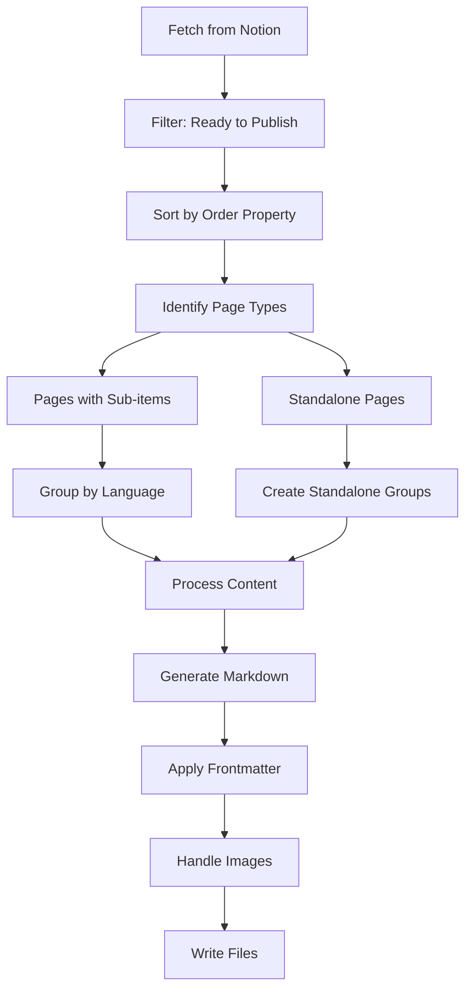

# CoMapeo Documentation Content Pipeline

## Overview

The CoMapeo documentation content pipeline automatically fetches content from Notion and generates a Docusaurus website. This document describes the enhanced pipeline that ensures **all pages with "Ready to publish" status appear in the sidebar**, regardless of content length.

## Pipeline Architecture

### 1. Data Fetching (`scripts/fetchNotionData.ts`)

The pipeline fetches pages from Notion using specific filters:

```typescript
const filter = {
  and: [
    {
      property: NOTION_PROPERTIES.STATUS,
      select: {
        equals: NOTION_PROPERTIES.READY_TO_PUBLISH,
      },
    },
    {
      property: "Parent item",
      relation: { is_empty: true },
    },
  ],
};
```

This filter ensures only top-level pages with "Ready to publish" status are fetched.

### 2. Page Processing (`scripts/notion-fetch/generateBlocks.ts`)

The enhanced processing logic handles two types of pages:

#### Pages with Sub-items (Traditional)

- **Definition**: Pages that have content in multiple languages via the "Sub-item" relation
- **Processing**: Creates grouped content by language
- **Example**: A page with English, Spanish, and Portuguese versions

#### Standalone Pages (New Feature)

- **Definition**: Pages without sub-items but with "Ready to publish" status
- **Processing**: Creates individual markdown files with proper frontmatter
- **Example**: Simple pages or placeholders that need to appear in the sidebar

### 3. Content Generation

#### For Pages with Content

```markdown
---
id: doc-page-name
title: Page Title
sidebar_label: Page Title
sidebar_position: 1
# ... other frontmatter
---

[Actual content from Notion]
```

#### For Empty Pages

```markdown
---
id: doc-page-name
title: Page Title
sidebar_label: Page Title
sidebar_position: 1
# ... other frontmatter
---

_This page is currently being developed. Content will be added soon._
```

## Key Features

### ✅ Complete Coverage

- **Before**: Only pages with sub-items were processed
- **After**: ALL pages with "Ready to publish" status are processed

### ✅ Sidebar Visibility

- Every "Ready to publish" page now appears in the Docusaurus sidebar
- Empty pages get placeholder content to maintain structure
- Proper navigation and SEO metadata for all pages

### ✅ Backward Compatibility

- Existing pages with sub-items continue to work exactly as before
- No breaking changes to current content structure

### ✅ Robust Error Handling

- Image processing failures fallback gracefully
- Empty content gets proper placeholder text
- Comprehensive logging for debugging

## Processing Flow



## Code Structure

### Main Functions

1. **`groupPagesByLang(pages, page)`**: Groups pages with sub-items by language
2. **`createStandalonePageGroup(page)`**: Creates groups for standalone pages
3. **`generateBlocks(pages, progressCallback)`**: Main processing function

### Processing Logic

```typescript
// Step 1: Process pages with sub-items
for (const page of pages) {
  const subItems = page.properties["Sub-item"]?.relation ?? [];
  if (subItems.length > 0) {
    const grouped = groupPagesByLang(pages, page);
    // ... process grouped content
  }
}

// Step 2: Process standalone pages
const standalonePages = pages.filter((page) => {
  const subItems = page.properties["Sub-item"]?.relation ?? [];
  return !processedPageIds.has(page.id) && subItems.length === 0;
});

for (const page of standalonePages) {
  const pageGroup = createStandalonePageGroup(page);
  // ... process standalone content
}
```

## Configuration

### Environment Variables

- `NOTION_API_KEY`: Notion integration API key
- `DATABASE_ID`: Notion database ID to fetch from

### Content Properties

- `Status`: Must be "Ready to publish"
- `Content elements`: Page title
- `Sub-item`: Relations to language-specific content
- `Element Type`: Page type (Page, Toggle, Heading)
- `Order`: Sorting order for sidebar position

## Debugging

### Logging Features

- **Page Processing**: Logs show which pages are being processed as standalone vs. with sub-items
- **Content Detection**: Logs indicate whether pages have content or are empty
- **File Generation**: Logs confirm file creation and frontmatter application

### Example Logs

```bash
🔍 Processing pages with sub-items...
  ✓ Processed page with sub-items: 1d81b081... - Introduction
🔍 Processing standalone pages...
Found 42 standalone pages to process
  ✓ Processed standalone page: 21f1b081... - Getting Started
Processing page: 21f1b081..., Getting Started
  ↳ Page content length: 0 characters
  ↳ Processing empty page - using placeholder content
  ↳ Added frontmatter with id: doc-getting-started, title: Getting Started
```

## Testing

### Unit Tests

Comprehensive test coverage in `scripts/notion-fetch/generateBlocks.test.ts`:

- ✅ Standalone page processing
- ✅ Empty content handling
- ✅ Mixed page type processing
- ✅ Frontmatter generation
- ✅ Edge case handling

### Integration Testing

Run the full pipeline with:

```bash
npm run notion:fetch
```

## Troubleshooting

### Common Issues

1. **Pages not appearing in sidebar**
   - Check Notion page status is "Ready to publish"
   - Verify page has "Content elements" title
   - Check logs for processing confirmation

2. **Duplicate route warnings**
   - Multiple pages with same slug
   - Review page titles and sanitization

3. **Image processing errors**
   - Network timeouts or compression failures
   - Images fallback to originals gracefully

### Quick Fixes

```bash
# Re-fetch all content
npm run notion:fetch

# Build and check for issues
npm run build

# Run tests
npm test scripts/notion-fetch/generateBlocks.test.ts
```

## Future Enhancements

### Potential Improvements

- **Content validation**: Ensure all required properties are present
- **Batch processing**: Optimize for large page counts
- **Incremental updates**: Only process changed pages
- **Advanced filtering**: More sophisticated content organization

### Monitoring

- Track processing success rates
- Monitor sidebar completeness
- Alert on missing required pages

## Conclusion

The enhanced content pipeline ensures comprehensive coverage of all "Ready to publish" Notion pages, providing a complete and navigable documentation structure. The system is designed to be robust, maintainable, and backward-compatible while providing clear visibility into the processing workflow.
