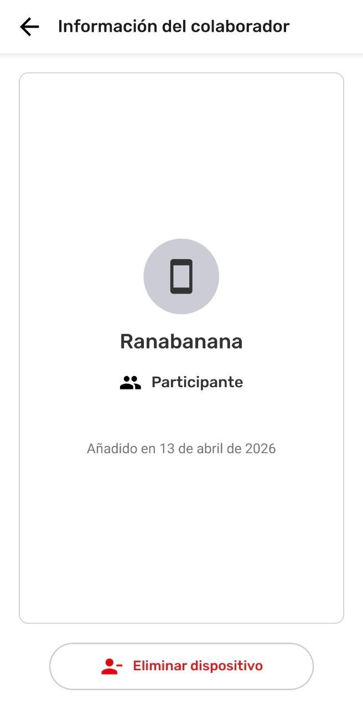
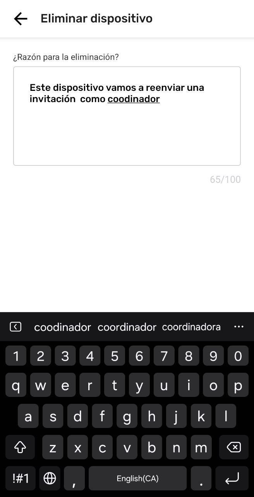
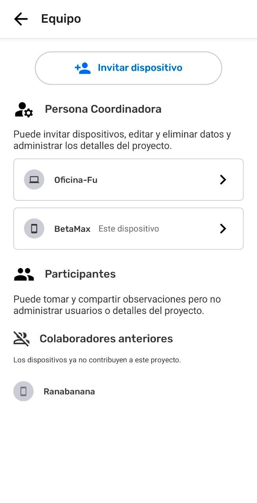

# Removing a Device from a project

Removing a device can only be done by coordinator devices. This action updates project information about the team, which is visible to all in the project.

## Coordinator Removes a Device

::::note 👣
### Step by Step

***Step 1:*** In the **Menu**, select  Team.

---

***Step 2:***  Select the device to be removed

---

***Step 3:*** Select  **Remove device**

---

***Step 4:*** Write the reason for removal. This will be visible to the device being removed.

---

***Step 5:*** Close the Keyboard and select  **Remove and notify**

---

***Step 6:*** In this coordinator device, the selected device has been removed. 

:::note ⚠️ Warning
The devices removed need to be connected to the same Wi-Fi router or have Remote Archive set up in order to receive the removal notification. If this does not happen, the removed devices  will continue in the project until the next time they connect with a different device in the project that has updated project information .

:::

---

***Step 6:*** Devices that were previously in a project are listed at the bottom.

::::

### Notifying the Removed Device

In an offline context, the notification of removal cannot be sent until the devices have connected to the same Wi-Fi router at the same time. The notification will include the reason written on the coordinator device that removed them.

### Updating project information from devices in the team

The  **Team** list is updated every time devices  **Exchange.** 

:::note 💡 Tip
The notification about device removal can be passed on through any device that has exchanged the updated information about the removed device.

:::

## Related Content

Go to 🔗 [Understanding Projects](/docs/understanding-projects)

Go to 🔗 [Leave a Project](/docs/leave-a-project) 

Go to 🔗 [Removing a device from a Project](/docs/removing-a-device-from-a-project)

Go to 🔗 [Understanding How Exchange Works](/docs/understanding-how-exchange-works)

### **Having problems?**

Go to 🔗 [Troubleshooting: Mapping with Collaborators](/docs/troubleshooting-mapping-with-collaborators)

