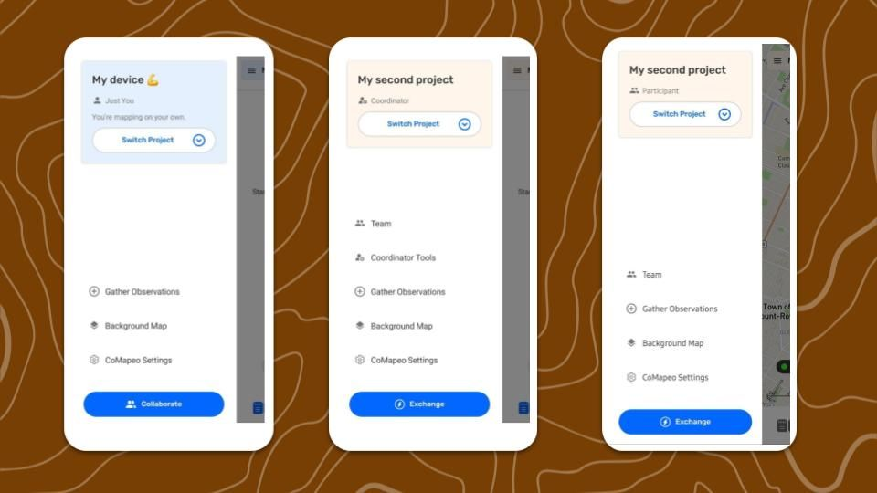

## What is “Mapping on your own”?

When CoMapeo is first installed on a new device it is set up to start collecting data within a project of which it is the only member, it is not collaborating with any other devices or teams. This might be ideal for individuals working independently, with no need for customized categories. 

:::note 👉🏽 Note
Changing category sets requires  Coordinator Tools which become visible after a project has been set up. There is no requirement for inviting devices for a project to have Customized Category Sets.

Go to 🔗 [Changing Categories Set](/docs/changing-categories-set) to follow necessary steps

:::

In some cases, people may want to backup and view the information they collected in a computer. To do this, install CoMapeo Desktop on the computer and invite it to the same project. This workflow works the same way as inviting a different mobile device to a project - both require the original device to invite them to collaborate. 

## Collecting Data with a Team and a Project

One of CoMapeo's strengths is to allow users to not only collect data on their own, but to collaborate with others as part of a team. To do this, users set up new projects, of which they become Coordinators, and then can invite other members as either Coordinators or Participants. These two roles have different permissions, outlined below. All users within the same project can exchange project data amongst themselves, and will have access to the same set of categories to collect data. They can also all exchange data with a Remote Archive, if it has been set up.

**What is a Team in CoMapeo**

 **Team** is the list of devices that are included in a project, and the roles that each device has been assigned. Teams can include anything from two devices upwards. 
Every device in the project can view the team information to know which other devices are part of their project, and every device can view all observations and tracks that have been exchanged.

## Roles available in CoMapeo

 **Participants** can create   Observations record Tracks, and  **Edit** their own observations, and distribute information using  **Exchange** or  **Share** or **Download Observations.**

 **Coordinators** can do all of the above. In addition they can   Edit  observations collected by others, and  use the  **Coordinator tools**  including inviting collaborators, adding customized categories, and enabling features like Remote Archive.  

Roles are assigned to devices by the coordinator which invites them, during the invite process. Roles are visible on the menu, and to all project members on the team screen. 

:::note 👉🏽 Note
If a role has been mis-assigned, cancel the invite if possible. If the invitation has been accepted, follow steps to remove the device.  Then repeat the invite device process again being careful to select the correct role.

See 🔗 [Removing a device from a Project](/docs/removing-a-device-from-a-project) 

:::

### Role Permissions in Detail

| Topic | User Actions | Coordinator | Participant |
| --- | --- | --- | --- |
| Collaboration | Create a new project | ✔️ | ✔️ |
| Collaboration | Invite Device to a project | ✔️ | ❌ |
| Collaboration | Assign a role to a device before sending invite | ✔️ | ❌ |
| Collaboration | After invite, edit user roles ( change from participant to coordinator, or vice versa) | ❌ | ❌ |
| Collaboration | Leave a project | ✔️ | ✔️ |
| Collaboration | Remove user from project | ✔️ | ❌ |
| Collaboration | See the list of devices on a project | ✔️ | ✔️ |
| Collaboration | Rename project | ✔️ | ❌ |
| Collaboration | Delete project | ❌ | ❌ |
| Collaboration | Exchange | ✔️ | ✔️ |
| Create Observations & Tracks | Collect observations (Mobile only) | ✔️ | ✔️ |
| Create Observations & Tracks | Record Tracks (Mobile only) | ✔️ | ✔️ |
| Review Collected Data | Review own observations and tracks | ✔️ | ✔️ |
| Review Collected Data | Review others’ observations and tracks | ✔️ | ✔️ |
| Editing Collected Data | Edit own observations on and tracks | ✔️ | ✔️ |
| Editing Collected Data | Edit others observations and tracks | ✔️ | ❌ |
| Editing Collected Data | Add media (photos and audio) to a saved observation (only with edit access) (mobile only) | ✔️ | ✔️ |
| Editing Collected Data | Delete own observations and tracks | ✔️ | ✔️ |
| Editing Collected Data | Delete media (photos and audio) from a saved observation | ❌ | ❌ |
| Editing Collected Data | Delete others’ observations and tracks | ✔️ | ❌ |
| Customizing the CoMapeo experience | CoMapeo Settings (App language, Coordinate system, security options) | ✔️ | ✔️ |
| Customizing the CoMapeo experience | Change Categories Set of a project (via Coordinator tools) | ✔️ | ❌ |
| Customizing the CoMapeo experience | Upload Background Map | ✔️ | ✔️ |
| Customizing the CoMapeo experience | Remove Background Map | ✔️ | ✔️ |
| Customizing the CoMapeo experience | Share Background Map | ✔️ | ✔️ |
| Customizing the CoMapeo experience | Receive Shared Background Map | ✔️ | ✔️ |
| Customizing the CoMapeo experience | Replace offline map | ✔️ | ✔️ |
| Output | Share - Single Observation | ✔️ | ✔️ |
| Output | Share  - Observation Metadata | ✔️ | ✔️ |
| Output | Share - Photo Metadata | ❌ | ❌ |
| Output | Download Observations and Tracks (GeoJSON, Zip with Media) | ✔️ | ✔️ |
| Security & Privacy | Diagnostic Information Collection options | ✔️ | ✔️ |
| Security & Privacy | App Usage Collection options | ✔️ | ✔️ |
| Security & Privacy | Secure Passcode (Mobile Only) | ✔️ | ✔️ |
| Security & Privacy | Obscure Passcode  (Mobile Only) | ✔️ | ✔️ |

## Related Content

Go to 🔗 [Creating a New Project](/docs/creating-a-new-project) 

Go to 🔗 [Inviting Collaborators](/docs/inviting-collaborators) for instructions 

Go to 🔗 [Understanding How Exchange Works](/docs/understanding-how-exchange-works) for full explanation 

### Having Trouble?

Go to 🔗 [Troubleshooting: Mapping with Collaborators](/docs/troubleshooting-mapping-with-collaborators)  

:::note 💡 Tip
To change the role of a device from  Participant to  Coordinator or from  Coordinator to  Participant, it needs to be sent a new invitation after either leaving a project, or being removed from a project.

:::
