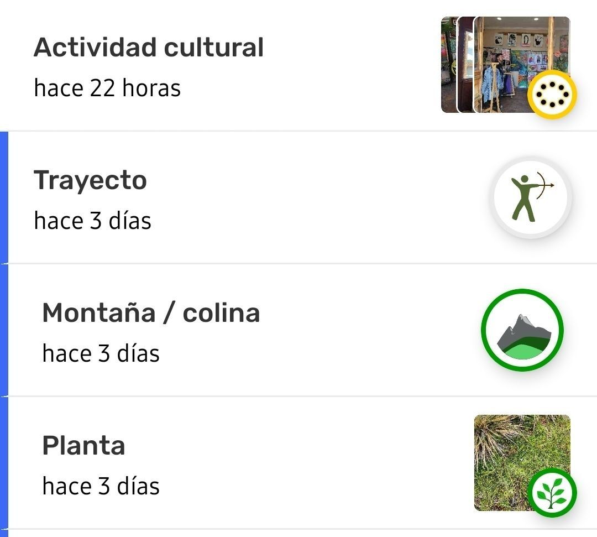
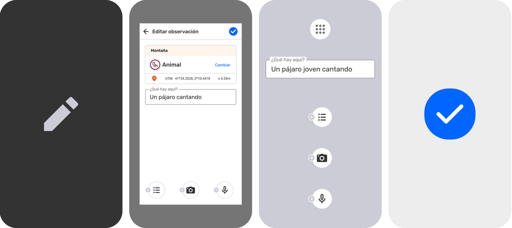
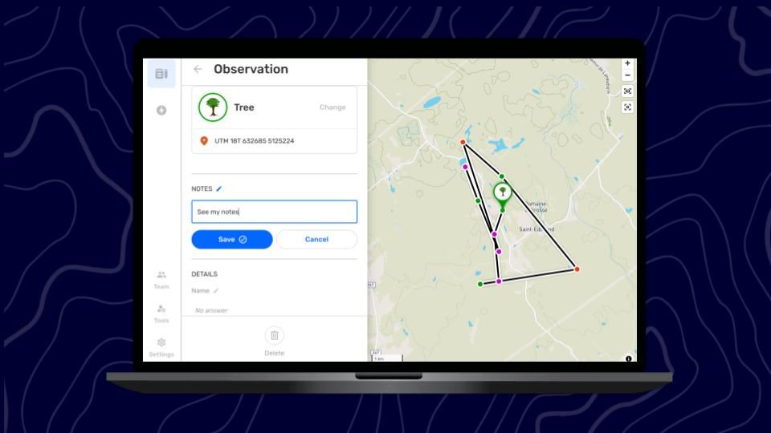
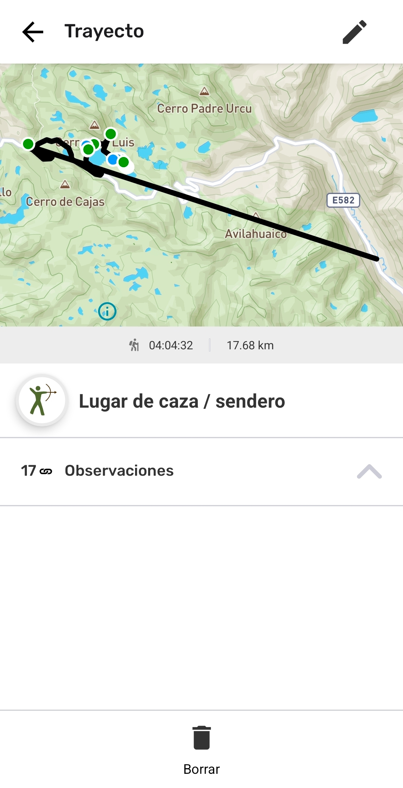
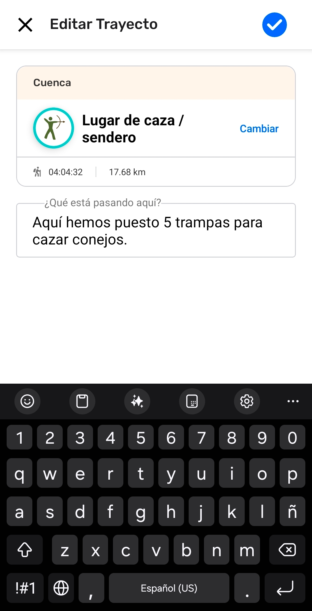

## Why edit observations and tracks?

The Edit observations option helps improve the quality of information gathered. Editing offers a simple solution to some common challenges that are encountered in the field:

- Correcting typing and other human errors.

- Correcting information after consulting knowledge holders or trusted references.

- Saving an observation quickly to get the correct coordinates, and then moving to safety before adding detailed information.

- Audio recording is used in the field to describe the observation, and later used as source information to add written description and complete the details.  

Before editing, review an observation or track to determine if edits are needed.   

:::note 💡 Tip
There is a common process in participatory mapping called **validation**, where information collected by mapping participants is reviewed by others who are trusted and experienced. Organizing transparent validation processes with the people involved in the project is recommended to keep gathered information high quality and up to date. Practicing this routinely before sharing outside on CoMapeo is recommended to reduce the need for editing in less accessible software.

:::

## Limited Permissions for Edit and Delete

Observations and Tracks created on a device can always be edited on, or deleted from, that same device. This means that the author can always edit or delete their own observations and tracks if they have not changed devices. 

A device with a  **Coordinator** role in a project has permission to edit or delete any and all observations and tracks in that project. This allows coordinators to help participants complete or correct information.  

A device with a  **Participant** role in a project is **not** able to edit observations or tracks received through  **Exchange.**  On the observation list, received Observations and Tracks are identified with the blue line on the left.

:::note 👉🏽 More
These permissions apply to both CoMapeo Mobile and CoMapeo Desktop.

:::

Go to 🔗 [Selecting Device Roles and Teams → Roles Available in CoMapeo](/docs/selecting-device-roles-and-teams#roles-available-in-comapeo) to learn more.

## Edit an observation

### What can be edited in an observation?

**Information added manually can be edited** 

- Category
:::note 👉🏽 More
Changing the category will change the associated fields to add details. Do this before editing the details.

:::

- Description

- Details, including short and selected answers

**Photos and audio can be added**

Both photos and audio can be added when editing an observation. This is for the benefit of improving the quality of observations collected under adverse conditions.  Photos and audio cannot be deleted after they have been saved.

:::note 💡 Tip
adding images of reference materials or recording relevant testimonies and stories can enrich the quality of an observation.

:::

The collected metadata of the additional photos includes location information at the time each photo is taken. Photo metadata can be viewed when reviewing an observation, but never edited.

Go to 🔗 [Reviewing Individual Observations & Tracks → Data Validation in CoMapeo](/docs/reviewing-individual-observations-and-tracks#data-validation-in-comapeo)  to learn more

### What cannot be edited?

**Information added automatically cannot be edited**

-  Coordinates and accuracy

- Date and Timestamp

- Observation Metadata

- Association with corresponding Track

:::note 👉🏽 More
This information comes from device sensors, device settings and application usage, and it can not be modified.

:::

:::note 👣
### Step by Step - Mobile

***Step 1:*** Tap on  **Edit** to open the editor

---

***Step 2:*** Confirm or **change** the Category

---

***Step 3:*** **Edit the description** as needed.

---

***Step 4:*** **Edit**   **details**, as needed.

---

***Step 5:*** **Add** supplementary  [photos](#adding-photos), and  [audio](#adding-photos) as needed.

---

***Step 6:*** Tap  **Save** to save edits to your observation.  

:::

::::note 👣
### Step by Step -  Desktop

:::note 💡 Tip
Click on  the fields that require edits.  The  Edit icon will turn blue to indicate you are editing.  Remember to   **Save** after every edit.

:::

---

***Step 1:*** Confirm or **change** the Category

---

***Step 2:*** **Edit the description** as needed.

***Step 3:*** Tap  **Save** to save new description.  

***Step 4:*** **Edit**   **details**, as needed.

---

***Step 5:*** Click   **Save** after every edit.

::::

:::note 👉🏽 More
On CoMapeo Desktop it is possible to permanently delete unneeded photos with edit access.
Go to 🔗 [Deleting Observations & Tracks → Deleting Media](docs/deleting-observations-and-tracks/#deleting-media) to learn more

:::

## Edit a Track

### What can be edited in a track?

**Information added manually can be edited** 

- Category

- Description

### What cannot be edited?

**Information added automatically cannot be edited**

- Polyline

- Date and Timestamp

- Association with corresponding Observations

Editing Tracks is used to, correct the category, or to view, add or correct the description.

:::note 👣
### Step by Step: Mobile

***Step 1:*** Select a Track to review from the  Map or from the  Observation list. 

---

***Step 2:*** Tap on  **Edit** to open the editor

---

***Step 3:*** Confirm or **change** the Category

---

***Step 4:*** **Edit the description** as needed.

---

***Step 5:*** Tap  **Save** to save edits to your track.  

:::

## How do Edit and Delete work with Exchange

Any changes to an Observation or Track will be updated to other devices during exchange. This includes edited categories and notes, added photos and audio, and deletion. CoMapeo will always display the latest available version of an observation or track. 

When working in teams it is best to have an agreed upon protocol for editing, deleting and exchanging collected information. This will help you avoid data conflicts, for example: if an observation has been exchanged with one or more coordinator devices, it is possible for one to edit an observation, and another to delete that same observation.

Go to 🔗 [Understanding How Exchange Works → What if there is a data conflict?](/docs/understanding-how-exchange-works#what-if-there-is-a-data-conflict)   to learn more

## Related Content

Go to 🔗 [Creating a New Observation](/docs/creating-a-new-observation)

Go to 🔗 [Exploring the Observations List](/docs/exploring-the-observations-list)

Go to 🔗 [Reviewing Individual Observations & Tracks](/docs/reviewing-individual-observations-and-tracks) 

Go to 🔗 [Deleting Observations & Tracks]([Deleting%20Observations%20&%20Tracks](/docs/editing-observations-and-tracks)%20%20/docs/deleting-observations-and-tracks) 

Go to 🔗 [Selecting Device Roles & Teams](/docs/selecting-device-roles-and-teams)

### **Having** Trouble?

Go to 🔗 [Troubleshooting: Observations & Tracks](/docs/troubleshooting-observations-and-tracks)

