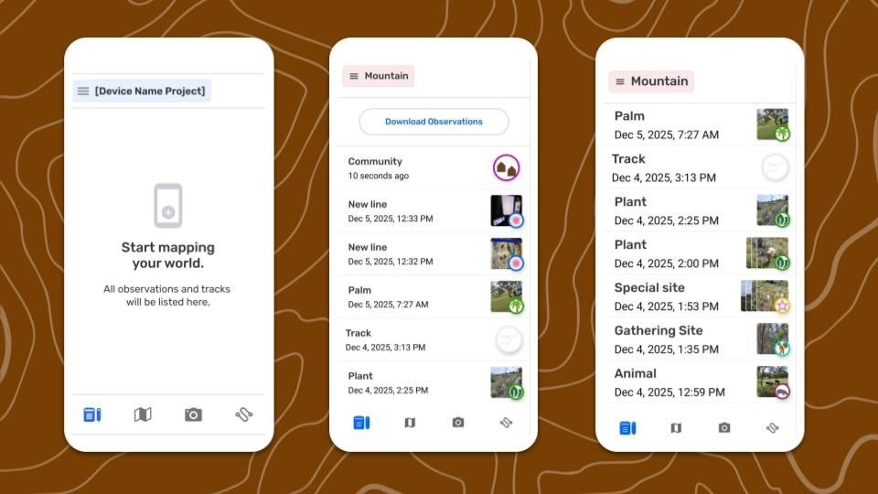
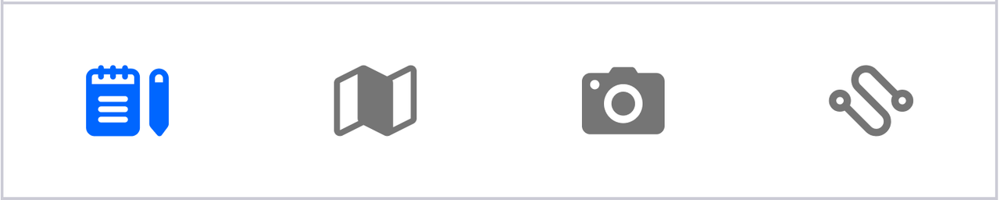
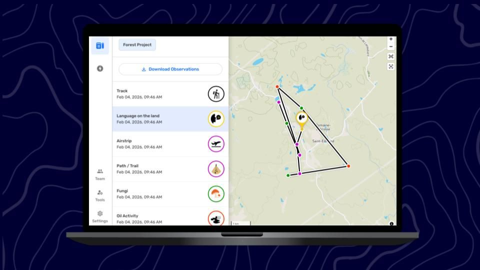

---

# Exploring the Observations List

For CoMapeo Mobile v8

## What is the Observations List

The  **Observations List** is the screen where all observations and tracks saved in a project can be viewed chronologically, with the newest at the top. This screen is helpful when searching for a specific observation  amongst many, especially in projects including observations and tracks received from other devices with  **Exchange**. The Observation List is an alternative to using the map screen, where you can also access information collected in a project by selecting observations from the map. 

:::note 💡 Tip
Access the Observation List any time from the main tabs on the bottom of the screen

:::

## Navigating the Observation List

This is the best place to review *specific* observations because category names, dates and times, and icons are visible at a glance.

Each item in the list provides a summary including:

- **Category Name**  (Observation only)
This is the predetermined label of a selected category.

- **Timestamp**
This is the date and time the Observation or track was first saved.  For observations and tracks taken the same day that the list is viewed, this informations is displayed as time since the observation was taken.

- **Category icon**
The icon displays at full size for tracks and observations without photos. This icon will display smaller when there are photo thumbnails.

- **Photo thumbnail**
Thumbnails of any photos attached to an observation are displayed as stacked tiles. These are helpful visual references when scrolling through a long list of observations.

- **Exchange indicators**
If the device has exchanged observations with other devices in a project then all the observations – yours and those of others – appear on this list.
Observations and tracks collected by other devices will have a vertical blue indicator line on the left margin. 

## Path to more features

The Observation List screen is the launching pad for some common data processing workflows:

**Observation List**

↳ Reviewing an observation 

↳ Reviewing a track

↳ Download observations

## Related Content

Go to 🔗 [Reviewing an Observation](/docs/reviewing-an-observation)  

Go to 🔗 [Exporting all Observations](/docs/exporting-all-observations) 

### **Having problems?**

Go to 🔗 [Troubleshooting: Observations & Tracks](/docs/troubleshooting-observations-and-tracks) 

