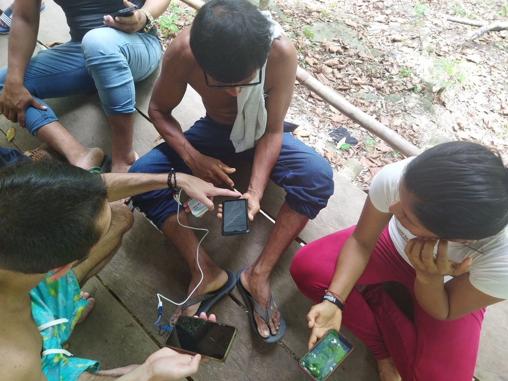
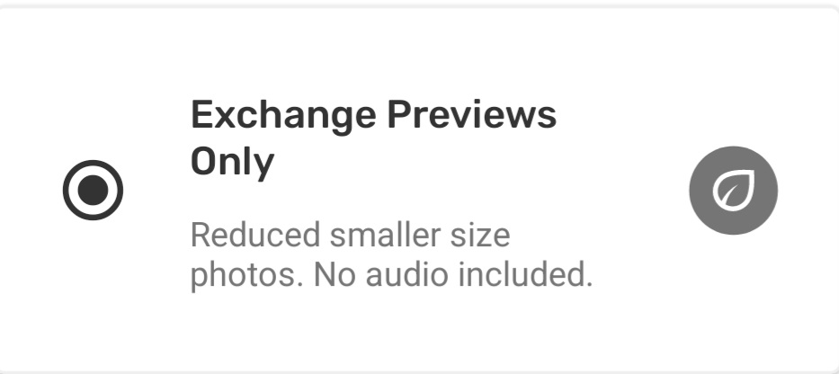
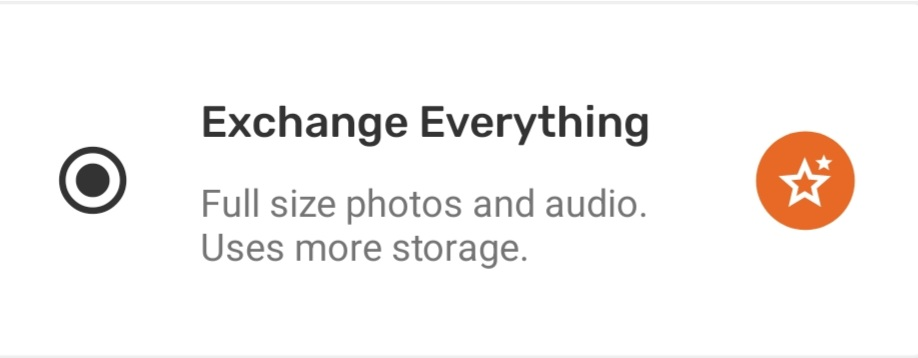
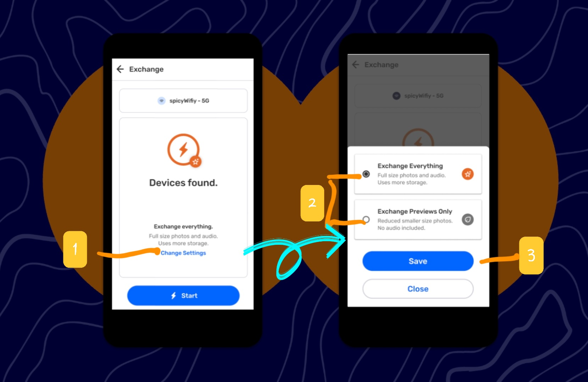

---

## **¿Qué es el Intercambio en CoMapeo?**

El **Intercambio** es la función principal de CoMapeo. Permite que los datos se transmitan de forma segura a todos los dispositivos conectados, que hacen parte de un mismo proyecto. Esto ayuda a garantizar que todos los participantes en un proyecto tengan la misma información.

- Esto posibilita que las ediciones realizadas en las observaciones y trayectos, se actualicen con los compañeros de equipo.

- Hace posible también, compartir con el equipo la información actualizada del proyecto, que incluye el último conjunto de categorías. Así, todos utilizarán las mismas plantillas de categorías y detalles.

**¿Qué datos se intercambian**

- Información del proyecto 
  - Nombre y descripción
  - Equipo (nombres de los dispositivos y roles)
  - Conjuntos de categorías actuales
  - Configuración del archivo remoto (en caso se utilice)

- Información registrada
  - Observaciones (con archivos multimedia y metadatos asociados)
  - Trayectos

**¿Qué sucede si hay un conflicto de datos?**

Un conflicto de datos ocurre cuando dos o más compañeros de equipo editan una misma observación o trayecto. Por ejemplo, una persona cambia la categoría de una observación o trayecto; y la otra, responde a una pregunta adicional de los detalles de la observación. 

También puede ocurrir si dos coordinadores de un mismo proyecto importan diferentes categorías personalizadas. En este caso **inusual y poco frecuente**, la última modificación realizada será la que se vea tras el intercambio. 

:::note ⚠️ Warning
The earlier edit will be lost.

:::

## ¿Qué tipo de conexiones utiliza CoMapeo?

**Es posible trabajar sin conexión a internet****, usando un router que brinde conexión WiFi local.**

Esta funcionalidad se diseñó para las personas que viven en zonas remotas, donde la conexión a Internet es limitada o no está disponible. Esto significa que los compañeros de equipo pueden intercambiar datos cuando estén juntos, independientemente del lugar en el que se encuentren.

:::note 💡
Un router actúa como un puente inalámbrico entre los dispositivos conectados a él, incluso cuando no está conectado a Internet.

:::

Ir a 🔗 [Intercambia datos sin conexión](/docs/intercambia-datos-sin-conexion)

**Es posible conectarse en línea si se configura un servidor remoto**

Para aquellos proyectos en los que es necesario utilizar el Intercambio, con más frecuencia de lo que permiten las actividades presenciales, diseñamos el *archivo remoto.* Esto permite añadir una dirección de servidor a la configuración específica de cada proyecto en CoMapeo.

Ir a 🔗 [Usa un Archivo Remoto](/docs/usa-un-archivo-remoto)

### ¿Cómo funciona el Intercambio?

A través del Intercambio, se detecta dispositivos de otros usuarios que están conectados a la misma red y que forman parte de los mismos proyectos en CoMapeo. Permite que los datos del proyecto se transfieran entre varios dispositivos, una vez que un usuario pulsa “Iniciar”. Al final del proceso, todos aquellos que hayan intercambiado datos podrán ver las nuevas observaciones y trayectos, que registraron sus compañeros de equipo en la pantalla del mapa y en la lista de observaciones.

Si alguien edita una observación o un trayecto (por ejemplo, cambia la categoría o añade detalles adicionales), o si un coordinador cambia el nombre del proyecto o actualiza las categorías y los íconos, estos datos también aparecerán en los dispositivos de todos los usuarios luego de completado el intercambio.

:::note 💡 Consejo
Los datos recopilados con CoMapeo solo se envían a los dispositivos que forman parte de los respectivos proyectos.

:::

:::note 👉🏽 Más información
Descubre cómo se gestiona la participación en los proyectos
Ir a 🔗 [Selección de roles y equipos de dispositivos](/docs/seleccion-de-roles-y-equipos-de-dispositivos)

:::

No existe ningún servidor central alojado por Awana Digital ni por terceros, que se utilice para cargar o descargar los datos recopilados por CoMapeo ni otros datos del Proyecto.

Ver 🔗 [Política de privacidad de datos de CoMapeo](https://www.notion.so/CoMapeo-Data-Privacy-d8f413bbbf374a2092655b89b9ceb2b0)  para obtener más información.

En su lugar, los datos del proyecto se distribuyen a todos los miembros del equipo que utilizan la función Intercambio. Esto significa que los datos recopilados como parte de un equipo, son datos colectivos visibles para todos los miembros del mismo proyecto, junto con cualquier configuración actualizada del mismo. Este tipo de distribución descentralizada de datos ofrece la ventaja de que se tenga una copia de seguridad de la información en todos los dispositivos que intercambian datos regularmente.

:::note 💡 Consejo
La configuración del Intercambio permiten elegir entre recibir imágenes a tamaño completo o en formato de vista previa. Así, se gestiona la cantidad de archivos multimedia almacenados en un dispositivo.

Ir a 🔗 [Configuración de Intercambio](#configuracion-de-intercambio) para obtener instrucciones

:::

El Intercambio permite que los colaboradores intercambien datos de forma segura entre ellos, siempre y cuando formen parte del mismo proyecto.

Ve a 🔗 [Encriptación y Seguridad](/es/docs/encryption-and-security) para obtener más información sobre los mecanismos técnicos que garantizan la seguridad del Intercambio en CoMapeo.

## Configuración de Intercambio

La función de Intercambio en CoMapeo crea una redundancia intencional de la información al clonar los datos recopilados en todos los dispositivos que participan en el Intercambio. Un dispositivo recibirá siempre miniaturas e imágenes de tamaño de vista previa junto con las observaciones a las que están asociadas para poder verlas en la aplicación. La **configuración de Intercambio** determina si las imágenes a tamaño completo se incluyen en la “solicitud” cuando se inicia Intercambio.

**Solo vistas previas de Intercambio**

El almacenamiento de archivos multimedia puede ser un problema para las personas con poco espacio en el dispositivo, o para todos los participantes en proyectos en los que se recopila un gran volumen de observaciones. En estos casos, mantener la configuración de Intercambio en “solo vistas previas” ayudará a reducir la cantidad de almacenamiento que CoMapeo utiliza en los dispositivos individuales.

:::note 👁️

:::

**Intercambiar todo**

Sin embargo, en algunos casos puede ser imprescindible que ciertos dispositivos tengan acceso a las imágenes en resolución completa. Esto es importante para las personas cuyas funciones implican presentar pruebas o informar a sus comunidades o a las autoridades locales.

Las miniaturas y las vistas previas de las fotos de las observaciones se siguen intercambiando cuando se selecciona esta configuración.

:::note 👁️

:::

:::note 👣
### Paso a paso

***Paso 1:*** En la pantalla de Intercambio, pulsa **Cambiar configuración**

---

***Paso 2:*** Selecciona entre **Intercambiar todo** o **Intercambiar solo vistas previas**

---

***Paso 3:*** Pulsa **Guardar** para volver a la pantalla de Intercambio

---

:::

## Múltiples proyectos & Intercambio

**Intercambio funciona de forma segura con varios proyectos**

CoMapeo está diseñado para mantener los datos seguros y organizados, incluso cuando se utiliza un solo dispositivo para más de un proyecto.

Los datos no se transfieren entre proyectos y no se mezclarán ni modificarán si se utilizan varios proyectos en cualquier dispositivo.

Ir a 🔗 [Comprende las Bases Sobre Proyectos](/docs/comprende-las-bases-sobre-proyectos) [→ Varios proyectos](/es/docs/understanding-projects#multiple-projects)

---

## Contenido relacionado

Ir a 🔗 [Intercambia datos Sin Conexión](/docs/intercambia-datos-sin-conexion)

Ir a 🔗 [Usa un Archivo Remoto](/docs/usa-un-archivo-remoto) 

Ir a 🔗 [Encriptación y Seguridad](/es/docs/encryption-and-security)

### ¿Tienes problemas?

Ir a 🔗 [Solución de Problemas: Mapeo con Colaboradores](/es/docs/troubleshooting-mapping-with-collaborators)

Ir a 🔗 [Solución de Problemas: Mapeo con Colaboradores](/es/docs/troubleshooting-mapping-with-collaborators) [-> Exchange Problems](/es/docs/troubleshooting-mapping-with-collaborators#exchange-problems) 

