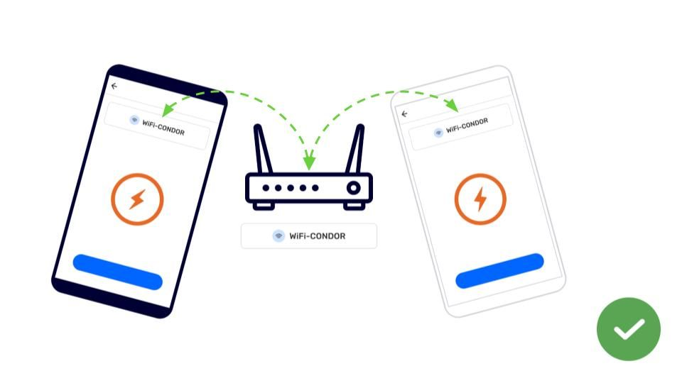

---

# Intercambia sin conexión a internet

## Intercambia con WiFi

Para Intercambiar se necesita cumplir 4 requisitos:

- Dos o más dispositivos con CoMapeo  

- Los dispositivos deben estar conectados a la misma red WiFi

- Los dispositivos deben pertenecer al mismo proyecto

- Nuevas observaciones o trayectos para intercambiar

 Visita 🔗 [Cómo funciona el Intercambio](/docs/entiende-como-funciona-el-intercambio) para obtener una descripción  completa y más detalles.

:::note 👣
### Paso a paso

***Paso 1:*** Abre el  menú

---

***Paso 2:*** Toca  **Intercambiar**  

***Paso 3:*** La pantalla de Intercambiar mostrará el mensaje “Dispositivos encontrados” cuando esté correctamente conectado a un router. 

Consejo: Ajusta la configuración de Intercambiar si es necesario.

Ve a 🔗 [Entiende cómo funciona el Intercambio -> Configuración de Intercambio](docs/entiende-como-funciona-el-intercambio#configuracion-de-intercambio)

---

***Paso 4:*** Toca **Iniciar** para indicar a los dispositivos conectados que estás listo para intercambiar datos del proyecto.

***Paso 5:*** Cuando otros dispositivos se unan a Intercambiar, todas las nuevas observaciones y datos relevantes del proyecto se intercambiarán.

---

***Paso 6:*** Se mostrará **Completo** cuando se hayan intercambiado todas las observaciones. Toca **Listo** para volver al  Menú

:::

:::note 💡 Consejo
El intercambio, sin conexión a internet, puede realizarse con rapidez si todos empiezan a intercambiar alrededor del mismo tiempo.

:::

---

## Contenido relacionado

Ve a 🔗 [Entiende cómo funciona el Intercambio](/docs/entiende-como-funciona-el-intercambio) para obtener una explicación detallada.

### ¿Tienes problemas?

Ve a 🔗 [Solución de Problemas: Mapeo con Colaboradores](/es/docs/troubleshooting-mapping-with-collaborators) [-> Exchange Problems](/es/docs/troubleshooting-mapping-with-collaborators#exchange-problems) 

Los problemas habituales al Intercambiar se relacionan con la conexión simultánea a la misma red WiFi, especialmente si el router o el punto de acceso móvil no están conectados a Internet. A menudo, los dispositivos se desconectan de una red WiFi para dar prioridad a otra que tenga conexión a Internet o que esté guardada en la memoria del dispositivo. Estos son algunos ajustes que puedes revisar para reducir los problemas de conexión al WiFi.

---

