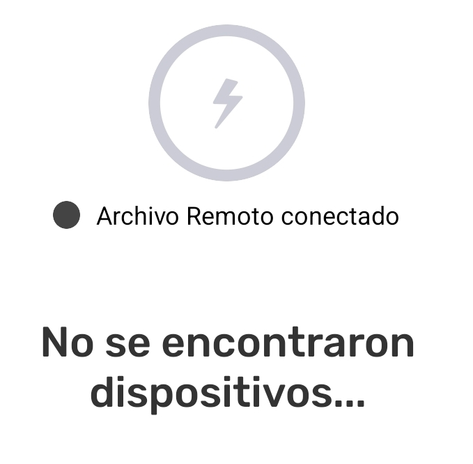

---

:::note ⚠️ Alerta
El intercambio con conexión a internet solo funciona con  **Archivo Remoto** activado.

:::

Para intercambiar con conexión a internet se necesita cumplir cinco requisitos:

1. Dos o más dispositivos con CoMapeo  

1. Los dispositivos deben tener acceso al internet

1. La preparacion del  **Archivo Remoto** se ha completado.

1. Los dispositivos deben pertenecer al mismo proyecto donde está activado  **Archivo Remoto**

1. Nuevas observaciones o trayectos para intercambiar

:::note 🔵 Visita
 🔗 [Cómo funciona el Intercambio](/docs/entiende-como-funciona-el-intercambio) para obtener una descripción completa y más detalles.

:::

::::note 👣
### Paso a paso

***Paso 1:*** Abre el  **menú**

---

***Paso 2:*** Toca  **Intercambiar**  

***Paso 3:*** La pantalla mostrará qué dispositivos están conectados. 

Cuando un proyecto tiene activado el  A**rchivo Remoto**, aparecerá conectado siempre que haya conexión a internet. Esto se mostrará justo debajo del icono grande de  **Intercambio**.

:::note 👉🏽 Más
Intercambiar con  **Archivo Remoto** funciona de igual manera si hay , o no hay otros dispositivos conectados con WiFi.

:::

:::note 💡 Consejo
**Ajusta la configuración de Intercambiar si es necesario.** Los ajustes de intercambio se pueden modificar para optimizar los resultados del dispositivo.

Ve a 🔗 [Entiende cómo funciona el Intercambio -> Configuración de Intercambio](docs/entiende-como-funciona-el-intercambio#configuracion-de-intercambio)

:::

---

***Paso 4:*** Toca **Iniciar** para comenzar el intercambio.

---

***Paso 5:*** Se mostrará **Completo** cuando se hayan intercambiado todas las observaciones. Toca **Listo** para volver al  Menú

::::

:::note 💡 Consejo
 Intercambio con o sin conexión a internet, puede realizarse simultáneamente.

:::

---

## Contenido relacionado

Ve a 🔗 [Entiende cómo funciona el Intercambio](/docs/entiende-como-funciona-el-intercambio) para obtener una explicación más detallada.

### ¿Tienes problemas?

Ve a 🔗 [Solución de Problemas: Mapeo con Colaboradores](/es/docs/troubleshooting-mapping-with-collaborators) [-> Exchange Problems](/es/docs/troubleshooting-mapping-with-collaborators#exchange-problems) 

---

