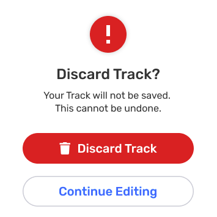

---

---

Para CoMapeo Móvil v8

# Crear un nuevo Trayecto

## ¿Qué es un Trayecto?

Un **Trayecto** graba tu movimiento en el mapa como una línea. Los Trayectos son útiles para documentar senderos, fronteras, ríos, rutas de monitoreo o patrulla, o cualquier camino que desees guardar y revisar más adelante. Los Trayectos te permiten registrar caminos o límites mientras te mueves por el territorio. 

De manera similar a las observaciones, los Trayectos están asociados con el proyecto en el que se crean.

## ¿Qué esperar al crear un Trayecto?

Mientras se graba un trayecto, se muestra información adicional:

- El progreso del trayecto se muestra mediante una línea azul punteada en el mapa.

- Indicador de grabación con el tiempo transcurrido y una etiqueta de distancia recorrida, que se ve junto a tu ubicación en el mapa.

- El indicador de grabación con el tiempo transcurrido también se muestra en la pestaña del trayecto.

CoMapeo registra todo lo anterior con permiso del dispositivo para acceder a la información de ubicación **todo el tiempo.**

---

::::note 👣
### Paso a paso

***Paso 1:*** Toca el ícono de Trayectos

:::note 👉🏽 Más
la primera vez que utilices esta función, Android solicitará un cambio de permiso de ubicación para usar la función. La aplicación podría pedir permiso para el GPS.
Ir a 🔗[Soluciones comunes - Permiso de dispositivo para CoMapeo Móvil](/es/docs/common-solutions) para aprender más.

:::

---

***Paso 2:*** **Pulsa** **Iniciar Trayectos** para comenzar a grabar tu trayecto.

---

***Paso 3:*** A medida que avances, CoMapeo dibujará una línea en el mapa a lo largo del camino. El Trayecto continuará registrándose mientras utilices otras funciones simultáneas en CoMapeo, uses otras aplicaciones, e incluso bloquees la pantalla para conservar la batería.

:::note 💡 Consejo
Mientras grabas un Trayecto, utiliza la barra inferior para navegar entre las herramientas de creación o revisión de observaciones.

:::

---

:::note 👉🏽 Más
Todas las observaciones que se recopilen, mientras se graba un trayecto, se vincularán a dicho trayecto para una fácil identificación al revisar.

:::

---

***Paso 4:*** Cuando esté completo, presiona de nuevo el ícono de  trayectos y presiona  **Detener Trayecto** .

---

***Paso 5:*** Selecciona la categoría que mejor describa lo que representa el trayecto.

***Paso 6:*** Agrega una descripción útil y pulsa  **Guardar** 

::::

---

## Interrupción de un Trayecto

La forma esperada de finalizar la grabación de un Trayecto es seleccionando Detente y  Guardar. Sin embargo, hay dos situaciones que pueden interrumpir la grabación de un Trayecto. Estos son:

- Aceptar una invitación a un proyecto mientras la grabación de Trayectos está activa

- Cambiar de proyectos mientras la grabación de Trayectos está activa

En ambos casos, aparecerá un mensaje con dos opciones:

**Cancelar** para permanecer en el proyecto donde se está grabando el trayecto, ignorando la interrupción.

 **Detener trayectos**, que no guardará el trayecto y procederá con cambiar proyectos o aceptar una invitación.

---

## Contenido relacionado

Ir a 🔗[Explorar la Lista de Observación](/es/docs/exploring-the-observations-list)

## **¿Tienes problemas?**

🔗 Ir a [Solución de problemas: Observaciones y Trayectos](/es/docs/troubleshooting-observations-and-tracks)

