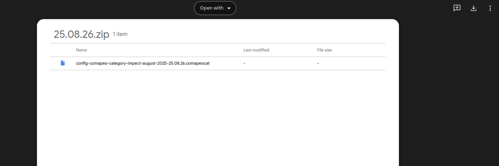

---

# Cambiar el conjunto de categorías

## ¿Qué se necesita para cambiar un conjunto de categorías?

✔️ Archivo personalizado del conjunto de categorías: .comapeocat.

✔️ Herramientas del Coordinador  visibles.

✔️  El dispositivo tiene un rol de Coordinador .

### Acceso a las herramientas del Coordinador

Cuando se realiza el mapeo por cuenta propia, las herramientas del coordinador se muestran luego de seguir los pasos para **iniciar un nuevo proyecto**.

Ir a 🔗 [Crea un Nuevo Proyecto](/es/docs/crea-un-nuevo-proyecto)

### Cargar un nuevo archivo de conjunto de categorías

El tipo de archivo **.comapeocat** es exclusivo de CoMapeo. No puede abrirse con ninguna otra aplicación ni con Android. Utiliza CoMapeo para cargar el archivo de conjunto de categorías en un proyecto seleccionado. Esta función solo lo pueden realizar los coordinadores de proyectos.

::::note 👣
### **Paso a paso: Móvil**

***Paso 1:*** Busca el archivo en tu carpeta de descargas y transfiérelo al teléfono móvil en el que estás utilizando CoMapeo. Puedes usar el correo electrónico, Google Drive, WhatsApp o la herramienta que te resulte más cómoda para enviar archivos a tu teléfono.

***Paso 2:*** Abre CoMapeo , y en el menú principal, **selecciona el proyecto** dónde se añadirá el nuevo conjunto de categorías.

***Paso 3:*** Abre ***Herramientas del Coordinador*** 

:::note ⚠️ Advertencia
Esto no es visible para los Participantes del proyecto

:::

***Paso 4:*** *Selecciona* **Categorías del proyecto**. 

***Paso 5:*** *Pulsa* **Importar Categorías** para abrir el selector de archivos de tu sistema operativo

***Paso 6:*** Busca el archivo de configuración de categorías (.comapeocat) y selecciónalo. CoMapeo intentará importar el archivo seleccionado. Si la operación se realiza correctamente, se actualizará la información de la pantalla “Categorías”. 

---

::::

:::note 💡 Consejo
Los conjuntos de categorías se incluyen en los datos del proyecto. Estos conjuntos se comparten con los nuevos compañeros de equipo una vez completada la invitación a los proyectos. También se incluyen al intercambiar información con los compañeros de equipo, lo que ayuda a mantener los proyectos actualizados.

Ir a 🔗 [Entiende cómo funciona el Intercambio](/docs/entiende-como-funciona-el-intercambio) para obtener una explicación detallada.

:::

---

## Revisar un conjunto de categorías

Para revisar el conjunto de categorías incluido en CoMapeo desde la propia aplicación, sigue los pasos para [crear una observación](/es/docs/creating-a-new-observation), [añadir detalles](/es/docs/creating-a-new-observation#agregar-detalles) y eliminar las observaciones guardadas como parte de la exploración.

Si es la primera vez que configuras un proyecto y modificas el conjunto de categorías, es probable que el siguiente paso sea invitar a colaboradores para recopilar datos en equipo.

Ve a 🔗 [Invitar a colaboradores](/es/docs/inviting-collaborators) para obtener instrucciones

## Contenido relevante

Ir a 🔗 [Crea un Conjunto de Categorías personalizadas](/es/docs/creating-a-custom-categories-set)

Ir a 🔗 [Welcome to CoMapeo Categories Library](https://www.earthdefenderstoolkit.com/welcome-to-the-comapeo-categories-library/) blogpost by María Alvarez

---

### ¿Tienes problemas?

Ir a 🔗 [Solución de problemas](/category/solucion-de-problemas) [→ changing categories set](/es/docs/troubleshooting-mapping-with-collaborators#project-setting-problems) 

---

