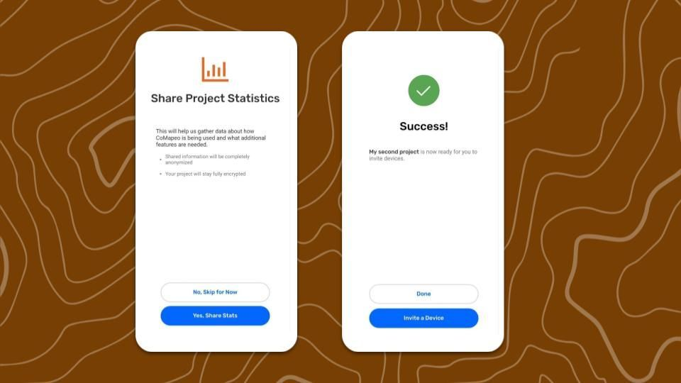

---

# Crear un nuevo Proyecto

## Iniciar un nuevo Proyecto

Un nuevo Proyecto comenzará sin observaciones, con las categorías y mapa de Fondo predeterminados de CoMapeo.

:::note 👣
### **Paso a Paso**

***Paso 1:*** Ve al **Menú**.

***Paso 2:*** Toca en  **Colaborar**

***Paso 3:*** Selecciona  I**niciar nuevo proyecto.**

***Paso 4:*** Agrega un **nombre de proyecto** y continúa

***Paso 5:*** Selecciona una opción de  **Estadísticas del Proyecto**. Esto puedes cambiarlo luego en Herramientas del Coordinador

***Paso 6:*** ¡Tu nuevo proyecto está listo!

:::

:::note 💡 Consejo
El proyecto que iniciaste al registrarte por primera vez en CoMapeo seguirá estando disponible, para volver en cualquier momento.

:::

El dispositivo que crea el nuevo Proyecto tiene rol de Coordinador y  acceso a nuevas opciones de menú.  Equipos y  Herramientas de Coordinador aparecerán en el  **Menú**

Ir a 🔗 [Invita Colaboradores](/es/docs/inviting-collaborators) para saber cómo invitar nuevos dispositivos al equipo

## Herramientas del Coordinador

###  Información del proyecto

- **Nombre**

- **Descripción:** Se puede agregar una descripción del propósito u objetivos del proyecto para que todos los integrantes del equipo estén alineados y consulten según sea necesario.

- **Color**

###  Archivo remoto

Herramienta opcional para usar un servidor local como respaldo.

Ir a 🔗 [Usa un Archivo Remoto](/docs/usa-un-archivo-remoto)

###  Categorías del Proyecto

Muestra detalles del **Conjunto de Categorías** actual

Ir a 🔗 [Cambia el Conjunto de Categorías](/docs/cambia-el-conjunto-de-categorías)

### **Estadísticas del Proyecto**

Configuración para compartir información analítica anónima para mejorar el desarrollo de CoMapeo

## Contenido Relacionado

Ir a 🔗 [Planificación y Preparación para un Proyecto](/docs/planificacion-y-preparacion-para-un-proyecto)

Ir a 🔗 [Selección de roles y equipos de dispositivos](/docs/seleccion-de-roles-y-equipos-de-dispositivos) para aprender cómo hacer tu proyecto colaborativo

Ir a 🔗 [Entiende cómo funciona el Intercambio](/docs/entiende-como-funciona-el-intercambio) para una explicación más detallada.

### ¿Tienes Problemas?

Ir a 🔗 [Solución de Problemas: Mapeo con Colaboradores](/es/docs/troubleshooting-mapping-with-collaborators)

---

