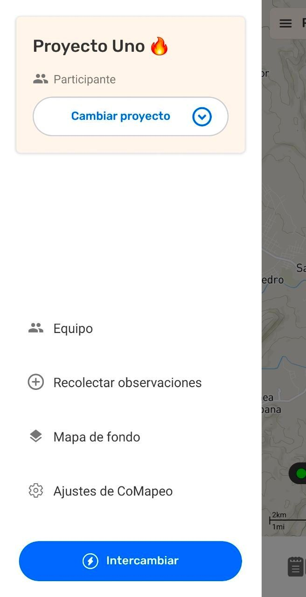
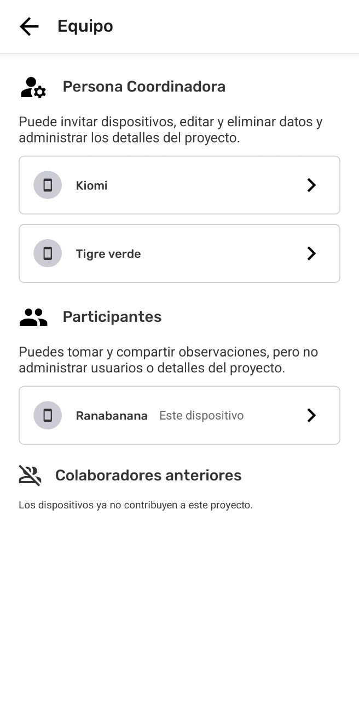

---

# Abandonar un Proyecto

## Acerca de Abandonar Proyectos

Abandonar un proyecto desconecta el dispositivo de la colaboración de la que era parte, detiene el intercambio de datos y elimina el proyecto de la lista. Dado que no es posible visualizar el proyecto, tampoco se puede acceder a los datos recopilados ni a la información del proyecto. 

:::note ⚠️ Advertencia
Al dejar un proyecto **no se elimina la información recolectada de ningún dispositivo**. Tampoco se libera el espacio de almacenamiento del dispositivo; solo evita que se produzcan futuros  Intercambios de ese proyecto.

:::

---

:::note 👣
### **Paso a paso**

***Paso 1:*** En el  **Menú**, selecciona  Equipo

---

***Paso 2:*** Selecciona **Este dispositivo** 

---

***Paso 3:*** Selecciona  **Abandonar Proyecto**

***Paso 4:*** Selecciona  **Sí, Abandonar**

***Paso 5:*** Este dispositivo abandonó el proyecto 

:::

## Informar al Equipo después de abandonar un Proyecto

En un contexto sin conexión a Internet, otros dispositivos del proyecto no sabrán que un dispositivo abandonó el proyecto hasta que los dispositivos se hayan conectado al mismo router Wi-Fi al mismo tiempo. Los datos del equipo de dispositivos se intercambiarán en segundo plano, actualizando la lista del  Equipo en el Proyecto.

:::note ⚠️ Advertencia
Si un dispositivo desinstala CoMapeo sin abandonar el proyecto, la lista del equipo no se actualizará. Un Coordinador podría remover el dispositivo para mantener la lista de participantes actualizada.

:::

### Actualización de la información del proyecto desde los dispositivos del equipo

La lista del  **Equipo** se actualiza cada vez que los dispositivos  **Intercambian.**

### ¿Esto se puede deshacer?

No es posible deshacer abandonar un proyecto ni eliminar un dispositivo de un proyecto. Sin embargo, siempre se puede volver a invitar a un dispositivo al proyecto. Después de completar un  Intercambio, se podrá ver toda la información recolectada nuevamente.

Ir a 🔗 [Invita Colaboradores](/es/docs/inviting-collaborators) para aprender más.

## Contenido relacionado

Ir a 🔗 [Comprende las Bases Sobre Proyectos](/docs/comprende-las-bases-sobre-proyectos)

Ir a 🔗 [Eliminar un dispositivo de un proyecto](/es/docs/removing-a-device-from-a-project)

### **¿Tienes problemas?**

Ir a 🔗 [Solución de Problemas: Mapeo con Colaboradores](/es/docs/troubleshooting-mapping-with-collaborators)

---

