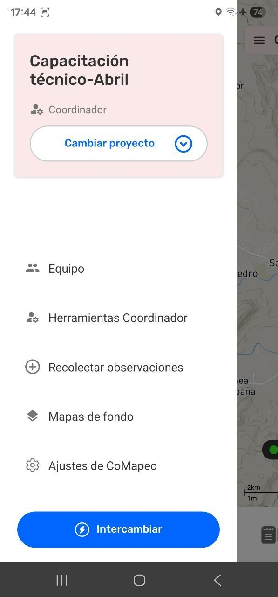
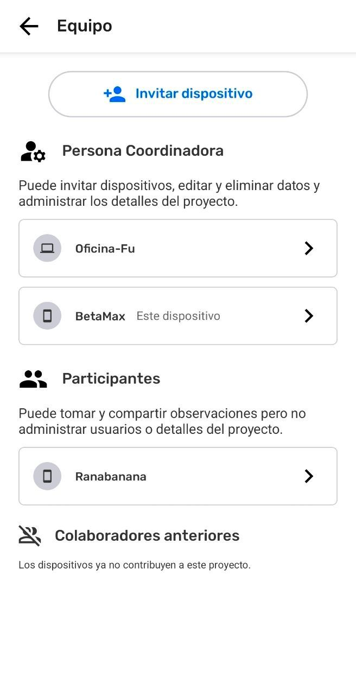
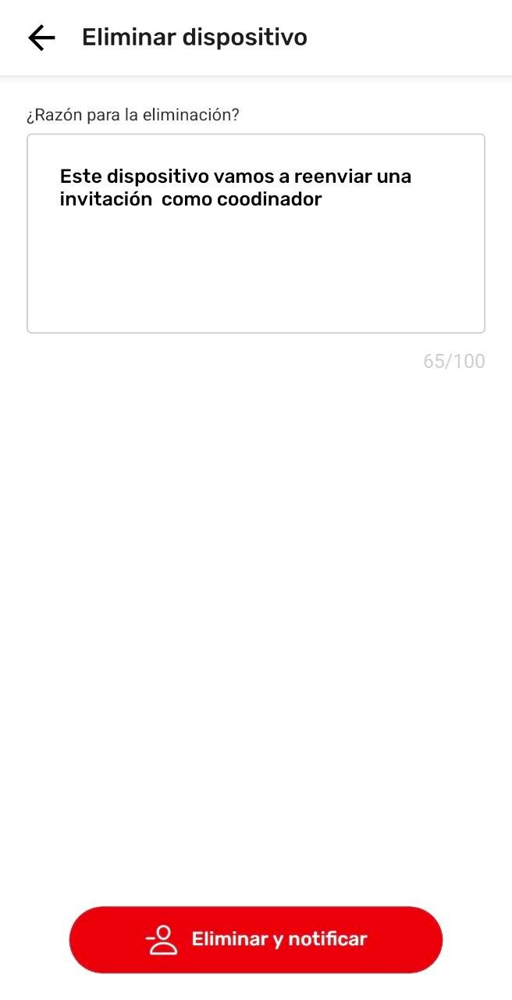
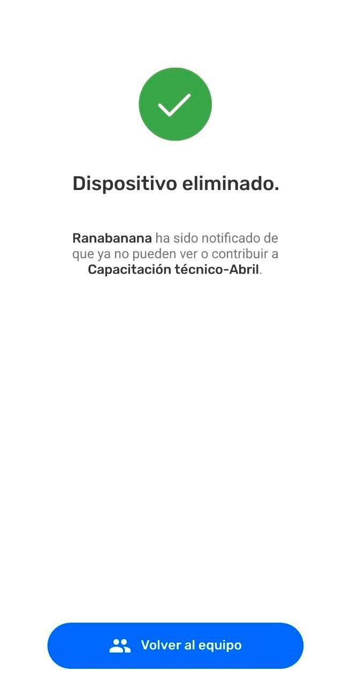
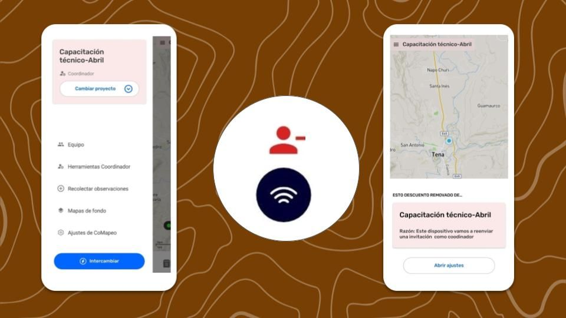
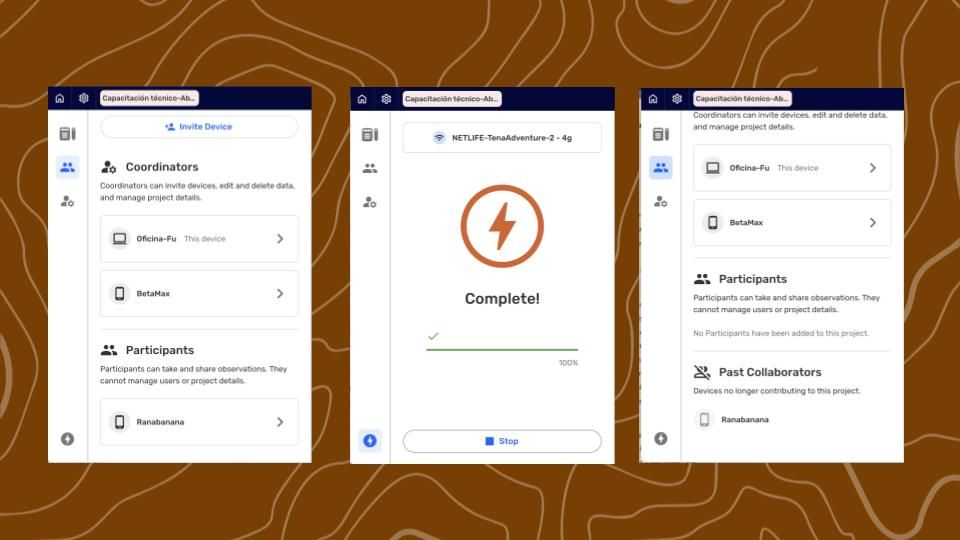

---

Quicklinks

# Eliminar un dispositivo de un Proyecto

La eliminación o remoción de un dispositivo solo puede ser realizado por  dispositivos coordinadores. Esta acción actualiza la información del equipo del proyecto, que es visible para todos los que están en él.

## Coordinador elimina un dispositivo

::::note 👣
**Paso a Paso**

***Paso 1:*** En el  **Menú**, selecciona  equipo.

---

***Paso 2:*** Selecciona el dispositivo a ser eliminado 

---

***Paso 3:*** Selecciona  **Eliminar dispositivo**

---

***Paso 4:*** Escribe la razón para la remoción. Esto será visible para el dispositivo que es eliminado.

---

***Paso 5:*** Cierra el teclado y selecciona  **Eliminar y notificar** 

---

***Paso 6:*** En este dispositivo coordinador, el dispositivo seleccionado fue removido

:::note ⚠️ Advertencia
Los dispositivos eliminados necesitan estar conectados al mismo router Wi-Fi o tener Archivo Remoto configurado para recibir la notificación de remoción. Si esto no sucede, los dispositivos eliminados continuarán en el proyecto hasta la próxima vez que se conecten con otro dispositivo en el proyecto, que tenga la información del proyecto actualizada.

:::

---

***Paso 6:*** Los dispositivos que estaban en un proyecto previamente, se listan al final.

::::

### Notificación al dispositivo removido

En un contexto sin conexión a internet, la notificación de remoción no puede ser enviada hasta que los dispositivos se hayan conectado al mismo router Wi-Fi al mismo tiempo. La notificación incluirá el motivo indicado en el dispositivo coordinador que lo eliminó.

### Actualización de la información del proyecto desde dispositivos del equipo

La lista del  **Equipo** se actualiza cada vez que los dispositivos  **Intercambian.**

:::note 💡 Consejo
La notificación de que un dispositivo fue eliminado puede enviarse desde cualquier otro equipo que haya intercambiado información actualizada del dispositivo eliminado.

:::

### ¿Esto puede deshacerse?

No se puede deshacer: abandonar un proyecto ni remover un dispositivo de éste. Sin embargo, un dispositivo siempre puede ser invitado de vuelta al proyecto. Después de completar un  Intercambio podrá ver toda la información registrada nuevamente.

Ir a 🔗 [Invita Colaboradores](/es/docs/inviting-collaborators) para aprender más.

## Contenido Relacionado

Ir a 🔗 [Comprende las Bases Sobre Proyectos](/docs/comprende-las-bases-sobre-proyectos)

Ir a 🔗 [Abandona un proyecto](/es/docs/leave-a-project)

Ir a 🔗 [Eliminar un dispositivo de un proyecto](/es/docs/removing-a-device-from-a-project)

Ir a 🔗 [Entiende cómo funciona el Intercambio](/docs/entiende-como-funciona-el-intercambio) 

### **¿Tienes problemas?**

Ir a 🔗 [Solución de Problemas: Mapeo con Colaboradores](/es/docs/troubleshooting-mapping-with-collaborators)

---

