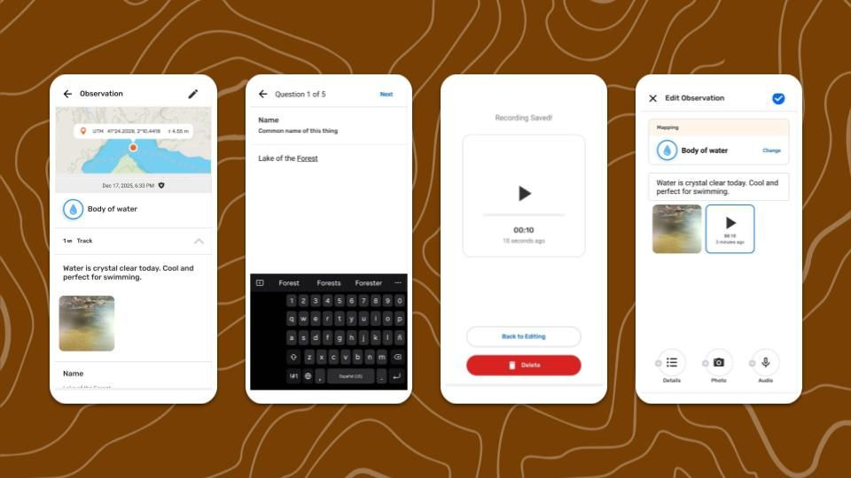
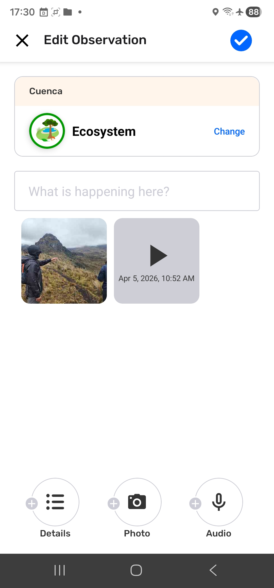
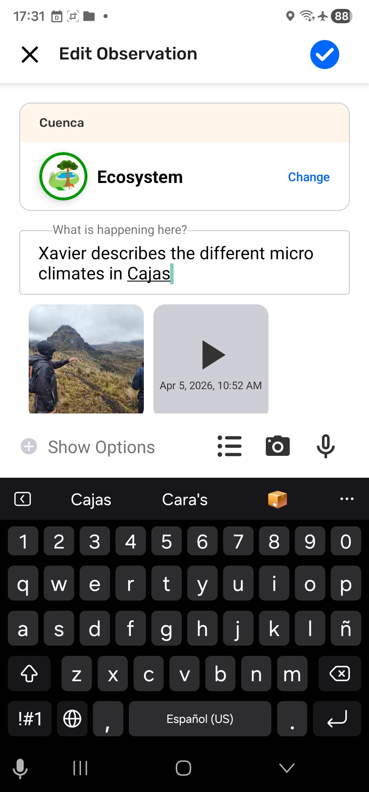
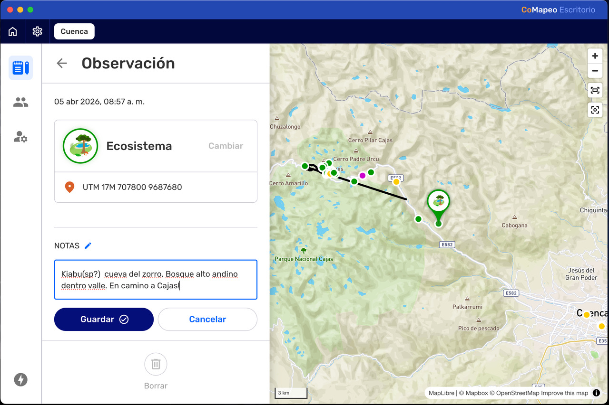

---

# Editar Observaciones

## ¿Por qué editar observaciones y trayectos?

La opción Editar observaciones ayuda a mejorar la calidad de la información recopilada. La edición ofrece una solución sencilla a algunos problemas habituales que surgen en el campo:

- Corregir errores de tipeo y otros errores humanos.

- Corregir la información luego de consultar a expertos o fuentes confiables.

- Guardar una observación rápidamente para obtener las coordenadas correctas y, luego, moverse a un lugar seguro antes de añadir información detallada.

- La grabación de audio se utiliza sobre el terreno para describir la observación y, posteriormente, se emplea como fuente de información para añadir una descripción escrita y completar los detalles.

Antes de editar, revisa una observación o un trayecto para determinar si es necesario modificarlo.

:::note 💡 Consejo
Existe un proceso habitual en el mapeo participativo denominado **validación**, en el que la información recopilada por los participantes en el mapeo es revisada por otras personas de confianza y con experiencia. Se recomienda organizar procesos de validación transparentes con las personas involucradas en el proyecto, para mantener una información de alta calidad y actualizada. Se recomienda practicar esto de forma rutinaria antes de compartirla en CoMapeo para reducir la necesidad de editarla en software menos accesible.

:::

## Permisos limitados para editar y eliminar

Las observaciones y los trayectos creados en un dispositivo siempre se pueden editar o eliminar desde ese mismo dispositivo. Esto significa que el autor siempre puede editar o eliminar sus propias observaciones y trayectos si no ha cambiado de dispositivo.

Un dispositivo con el rol de  **Coordinador** en un proyecto tiene permiso para editar o eliminar todas y cada una de las observaciones y trayectos de ese proyecto. Esto permite a los coordinadores ayudar a los participantes a completar o corregir la información.

Un dispositivo con el rol de  **Participante** en un proyecto **no** puede editar las observaciones ni los trayectos recibidos a través del  **Intercambio**. En la lista de observaciones, las Observaciones y Trayectos recibidos se identifican con una línea azul a la izquierda.

:::note 👉🏾 Más información
Estos permisos se aplican tanto a CoMapeo Móvil como a CoMapeo Desktop

:::

Ir a 🔗 [Selección de roles y equipos de dispositivos → Roles disponibles en CoMapeo](/docs/seleccion-de-roles-y-equipos-de-dispositivos#roles-disponibles-en-comapeo) para aprender más.

## Editar una observación

### ¿Qué se puede editar en una observación?

**La información añadida manualmente se puede editar**

- Categoría

:::note 👉🏾 Más información
Al cambiar la categoría, se modificarán los campos asociados para añadir detalles. Hazlo antes de editar los detalles.

:::

- Descripción

- Detalles, incluidas respuestas breves y seleccionadas

**Se pueden añadir fotos y audio**

Al editar una observación, se pueden añadir tanto fotos como audios. Esto tiene como objetivo mejorar la calidad de las observaciones recopiladas en condiciones adversas. Las fotos y los audios no se pueden eliminar una vez guardados.

:::note 💡 Consejo
añadir imágenes de materiales de referencia o grabar testimonios e historias relevantes puede mejorar la calidad de una observación.

:::

Los metadatos recopilados de las fotos adicionales incluyen información sobre la ubicación en el momento en que se tomó cada foto. Los metadatos de las fotos se pueden consultar al revisar una observación, pero nunca se pueden editar.

Ve a 🔗 [Revisa una Sola Observación y Trayecto  → Validación de datos en CoMapeo](/docs/revisa-una-sola-observacion-y-trayecto#validacion-de-datos-en-comapeo)  para obtener más información.

### ¿Qué no se puede editar?

**La información añadida automáticamente no se puede editar**

- Coordenadas y precisión 

- Fecha y hora

- Metadatos de la observación

- Asociación con el trayecto respectivo

:::note 👉🏾 Más información
Estos datos proceden de los sensores del dispositivo, la configuración del mismo y el uso de las aplicaciones, y no se pueden modificar.

:::

:::note 👣
### Paso a paso -  Móvil

***Paso 1:*** Toca  **Editar** para abrir el editor

---

***Paso 2***: Confirma o **modifica** la categoría 

---

***Paso 3:*** **Edita la descripción** según sea necesario.

---

**Paso 4: Edita los**  **detalles** según sea necesario.

---

**Paso 5:** **Añade**  fotos y  audios complementarios según sea necesario.

---

***Paso 6***: Pulsa  **Guardar** para guardar los cambios realizados en tu observación. 

:::

::::note 👣
### Paso a paso -  Desktop

:::note 💡 Consejo
Haz clic en los campos que quieras modificar. El icono de  edición se volverá azul para indicar que estás editando. Recuerda  **guardar** después de cada modificación.

:::

---

***Paso 1:*** Confirma o **cambia** la categoría

---

***Paso 2:*** **Edita la descripción** según sea necesario.

***Paso 3:*** Pulsa  **Guardar** para guardar la nueva descripción.

***Paso 4:*** **Edita** **los**  **detalles**, según sea necesario.

***Paso 5***: Haz clic en  **Guardar** después de cada modificación.

::::

:::note 👉🏾 Más información
En CoMapeo Desktop es posible eliminar definitivamente las fotos que ya no se necesiten si se dispone de permisos de edición.
Ir a 🔗 [Borrando Observaciones y Trayectos → Eliminar archivos multimedia](/docs/borrando-observaciones-y-trayectos#eliminar-archivos-multimedia) para obtener más información.

:::

## Editar un trayecto

### ¿Qué se puede editar en un trayecto?

**La información añadida manualmente se puede editar**

- Categoría

- Descripción

### ¿Qué no se puede editar?

**La información añadida automáticamente no se puede editar**

- Polilínea

- Fecha y hora

- Asociación con las Observaciones respectivas

La edición de trayectos se utiliza para corregir la categoría o para ver, añadir o corregir la descripción.

:::note 👣
### Paso a paso -  Móvil

***Paso 1***: Selecciona un trayecto para revisar desde el  mapa o desde la  lista de observaciones. 

---

***Paso 2***: Toca  **Editar** para abrir el editor

---

***Paso 3:*** Confirma o **cambia** la categoría

---

***Paso 4:*** **Edita la descripción** según sea necesario.

***Paso 5:*** Pulsa  Guardar para guardar los cambios en tu trayecto.  

:::

## ¿Cómo funcionan la edición y eliminación en el Intercambio?

Cualquier cambio realizado en una observación o un trayecto se actualizará en los demás dispositivos durante el intercambio. Esto incluye las categorías y notas editadas, las fotos y los archivos de audio añadidos, así como los eliminados. CoMapeo siempre mostrará la última versión disponible de una observación o un trayecto.

Cuando se trabaja en equipo, es mejor contar con un protocolo acordado para editar, eliminar e intercambiar la información recopilada. Esto ayudará a evitar conflictos de datos; por ejemplo: si una observación se ha intercambiado con uno o más dispositivos coordinadores, es posible que uno edite una observación y otro elimine esa misma observación.

Ve a 🔗 [Entiende cómo funciona el Intercambio → ¿Qué sucede si hay un conflicto de datos?](/docs/entiende-como-funciona-el-intercambio#que-sucede-si-hay-un-conflicto-de-datos)  para obtener más información

## Contenido relacionado

Ir a 🔗 [Crea una Nueva Observación](/es/docs/creating-a-new-observation) 

Ir a 🔗 [Explora la Lista de Observaciones](/es/docs/exploring-the-observations-list)

Ir a 🔗 [Revisa una Sola Observación y Trayecto](/docs/revisa-una-sola-observacion-y-trayecto) 

Ir a 🔗 [Borrando Observaciones y Trayectos](/docs/borrando-observaciones-y-trayectos)

Ir a 🔗 [Selección de roles y equipos de dispositivos](/docs/seleccion-de-roles-y-equipos-de-dispositivos)

### ¿Tienes problemas?

Ve a 🔗 [Solución de Problemas: Observaciones y Trayectos](/es/docs/troubleshooting-observations-and-tracks)

---

