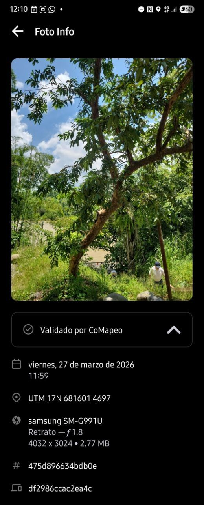
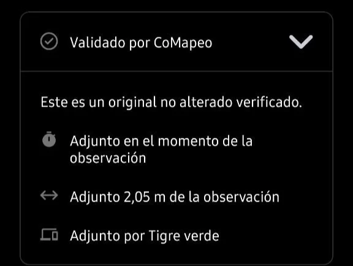
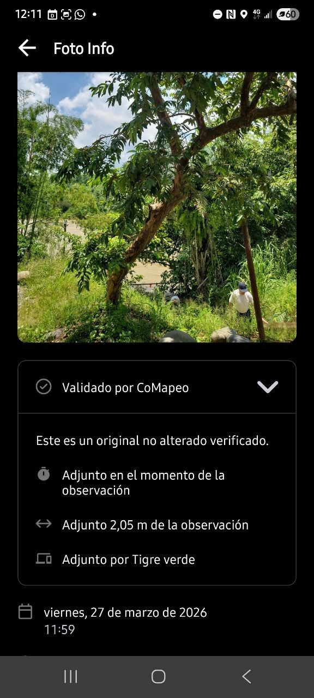
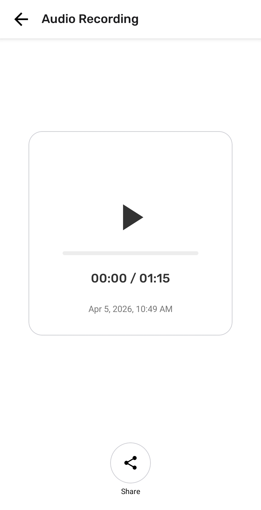
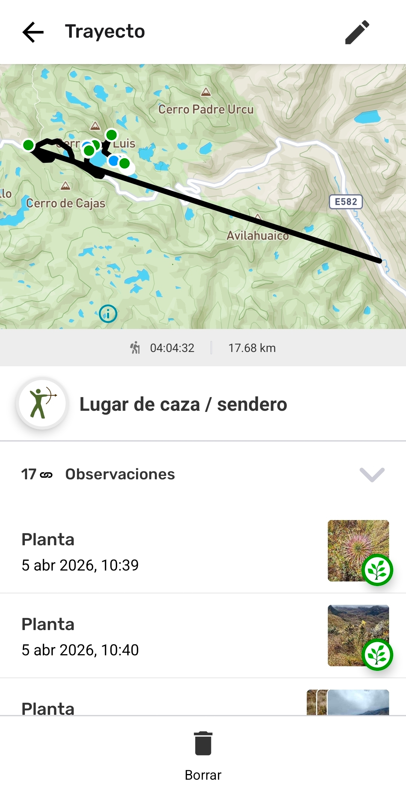

# Revisar una Observación

Para CoMapeo móvil v8

## ¿Qué es una Observación?

Una **Observación** es un dato vinculado a una categoría y asociado a un único conjunto de coordenadas, que representa un punto en un mapa. Puede contener diversa información que ayuda a contar una historia o sirva como evidencia. Las Observaciones se recopilan en CoMapeo y constituyen las principales fuentes de datos, junto con los trayectos.

:::note 💡 Consejo
 Para abrir una Observación y editarla, selecciónala desde el  mapa o desde la  lista de observaciones.

:::

## **¿Por qué revisar una observación?**

Revisa una observación para ver toda la información que se guardó con ella. La revisión puede ayudar a confirmar los detalles, verificar las evidencias y garantizar que los datos sean completos y precisos.

## **¿Qué información contiene una observación?**

### Información añadida automáticamente

Esta información procede de los sensores del dispositivo, la configuración del dispositivo y el uso de la aplicación, y no se puede modificar.

**Coordenadas y precisión**
La ubicación de la observación se muestra en la vista previa del mapa. Este suele ser el dato más importante que hay que incluir, cuando se trata de una observación o se quiere compartirla, especialmente con las autoridades y los especialistas en SIG.

**Registro de fecha y tiempo**

Esta información procede de la configuración del sistema del dispositivo en el momento en que se registró la observación.

**Metadatos de la Observación**

Son los metadatos asociados a las coordenadas registradas. Cuando el GPS está activado, estos metadatos se capturan directamente de los sensores y añaden información técnica que puede ser de interés para cualquiera que realice un análisis forense de una observación. Hay una pantalla específica para mostrar esta información.

**Trayecto correspondiente**

Si la Observación se registró mientras se grababa una ruta, también aparecerá la etiqueta del trayecto.

### Información añadida manualmente

**Nombre e icono de la categoría**

**Descripción**

Notas añadidas en el área de texto

**Detalles**

Respuestas del formulario **Detalles** (si se ha completado), que incluye campos de texto o preguntas estructuradas asociadas a la categoría elegida.

:::note 💡 Consejo
Comprueba que la información añadida describe correctamente lo que se observó. Si hay algo que deba revisarse o aclararse, se puede editar.

Ir a 🔗 [Edita Observaciones](/docs/edita-observaciones)

:::

### Archivos multimedia

Si se añaden fotos o archivos de audio a una observación, éstas se adjuntan automáticamente a ella.

**Miniaturas y vistas previas de fotos**

Todas las miniaturas de las fotos tomadas se mostrarán en un carrusel horizontal.

**Metadatos de las fotos**

Una pantalla que muestra los metadatos asociados a una foto tomada con CoMapeo.

**Miniaturas de audio y reproducción**

Se mostrará una miniatura de audio por cada grabación.

## Validación de datos en CoMapeo

Poder confiar en los datos, en su procedencia y en que no han sido manipulados es importante para generar confianza en las herramientas y en las metodologías de recopilación de datos. También puede ser fundamental si los datos van a ser admitidos en casos judiciales, en cuyo caso las pruebas deben ser trazables y verificables, lo que significa que se debe poder confirmar cómo, cuándo y dónde se recopilaron los datos.

Una observación **validada por CoMapeo** cuenta con coordenadas GPS y fotos registradas mediante CoMapeo, que se utilizan como medio para reforzar su valor probatorio. Para ello, CoMapeo requiere permisos relacionados con la localización de su dispositivo y el uso de la cámara del mismo. Sin estos dos permisos, CoMapeo aún puede recopilar datos a través de opciones de introducción manual, pero estos se marcan como **observaciones no validadas**, ya que CoMapeo no puede garantizar que se hayan ingresado correctamente.

**Los metadatos de observación** que se muestran en CoMapeo siempre incluirán la fecha y la hora, las coordenadas GPS, la latitud y la longitud.

 Los metadatos **validados** también mostrarán la precisión, la altitud, la precisión de la altitud y la velocidad.

 Los metadatos **no validados** mostrarán el mensaje *«Estos datos se han introducido manualmente»*, para dejar claro que las coordenadas proceden de una introducción manual y no del GPS automático y verificable del teléfono.

:::note 👉🏾 Más información
Si se guarda el archivo con coordenadas ingresadas manualmente, la mayor parte de los metadatos del GPS no estarán disponibles y aparecerá un aviso indicando que la observación no está validada.

:::

:::note 👉🏾 Consejo
Para compartir los metadatos de la Observación con alguien de tu equipo, utiliza  **Compartir**. Elige entre correo electrónico y WhatsApp para abrir un borrador de mensaje con formato, listo para enviar.

:::

**Los metadatos de las fotos** son datos que captura un smartphone y que son específicos de cada foto tomada. Se muestran debajo de la foto.

Si existen dudas de la validez de una foto en una observación, los metadatos de la foto pueden incluirse como prueba. Estos metadatos incluyen:

- Fecha y hora

- Coordenadas GPS de la fotografía

- Metadatos del dispositivo: tipo de dispositivo, detalles de la cámara (incluida la apertura) y tamaño de la foto

- ID de la observación

- ID del dispositivo

Abrir  **Validado por CoMapeo** para ver detalles adicionales que indican la proximidad, tanto en tiempo como en distancia, entre el momento en que se tomó la foto y el momento en que se guardó la observación. 

:::note 💡 Consejo
Para capturar toda la información disponible en una sola imagen, utiliza la opción desplázate hacia abajo , que aparece temporalmente luego de realizar una captura de pantalla.

:::

## Reviewing Audio

Audio recordings can be reviewed in CoMapeo Mobile by selecting the thumbnail and pressing  **Play.**

## Reviewing a Track

Review a **Track** to see the information that was saved with it. Tracks appear chronologically along with observations in the **Observation List** with a category icon.  They can also contain additional notes, and associations with Observations that are collected between the start and end point.

:::note 💡 Tip
You can open a Track for review by selecting it from the  Map or from the  Observation list.

:::

### What Information is within a Track?

> [!NOTE]
> Unsupported Notion block: `heading_4`

This information comes from device sensors, device settings, and application usage, and can not be modified.

**Polyline**

The combination of connected line segments that form a dynamically recorded line on a Map as recorded by the device sensors during a specific timeframe. In mapmaking, Polylines are commonly used to draw linear features on a map like paths, boundaries or rivers. 

**Date and Timestamp**

This information comes from the device’s system settings, at the time the Track is saved. 

**Corresponding observations**

Any Observation collected while a Track is being recorded will also appear under a dropdown list on the track screen. The view of corresponding Observations is very useful for understanding what happened over the course of a trip.  

## Más acciones disponibles

 Editar una observación 

 Eliminar una observación

 Compartir una observación

## Contenido relacionado

Ir a 🔗 [Editar Observaciones](/docs/edita-observaciones)

Ir a 🔗 [Comparte una sola Observación y Metadatos](/es/docs/sharing-a-single-observation-and-metadata)

Ir a 🔗 [Solución de Problemas: Observaciones y Trayectos](/es/docs/troubleshooting-observations-and-tracks)

Ir a 🔗 [**Solution: Check app permissions](/es/docs/troubleshooting-data-privacy-and-security)

### ¿Tienes problemas?

Ir a 🔗 [Troubleshooting: Observations & Tracks](/es/docs/troubleshooting-observations-and-tracks)

