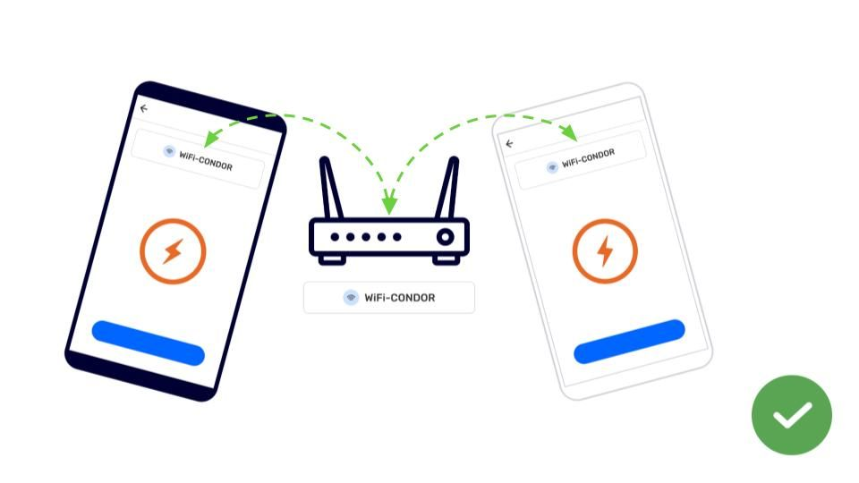
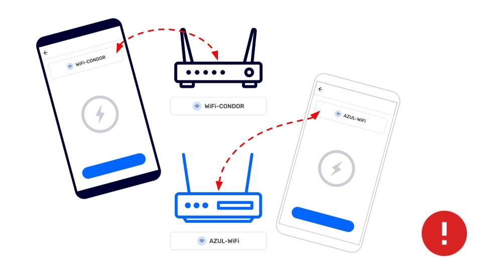

---

# Trocar Informações sem conexão com a Internet

## Trocar Informações com Wi-Fi

---

Para fazer a Troca de Informações são necessárias 5 coisas:

- Dois ou mais dispositivos com o aplicativo  CoMapeo instalado,

- Os dispositivos devem estar conectados **à mesma rede WiFi,**

- Os dispositivos devem fazer parte **do mesmo projeto,**

- Ter coletado novas observações ou trilhas,

- Ter as informações do projeto atualizadas.

Acesse: 🔗[Entendendo Como a Troca Funciona](/pt/docs/understanding-how-exchange-works) para uma visão geral e mais detalhes

:::note 👣
### Passo a Passo

***Passo 1:*** Abra oMenu

***Passo 2:*** Toque em   ***Trocar***

***Passo 3:*** A tela de troca exibirá "Dispositivos Encontrados" quando estiver corretamente conectada a um roteador.

💡 **Dica**: As configurações de troca podem ser ajustadas, se necessário.

Acesse: 🔗[Entendendo Como a Troca Funciona -> Configurações de Troca](/pt/docs/understanding-how-exchange-works#adjusting-exchange-settings)

---

***Passo 4:*** Toque em **Iniciar** para permitir que dispositivos conectados saibam que você está pronto para trocar dados do projeto.

***Passo 5:*** Quando outros dispositivos se juntam a Troca, todas as novas observações e dados relevantes do projeto serão trocados.

***Passo 6:*** A palavra **Completo** será exibida quando todas as observações forem trocadas. Toque em **Concluído** para retornar aoMenu.

:::

:::note 💡 Dica
A troca offline pode ocorrer rapidamente se todos começarem a troca mais ou menos ao mesmo tempo.

:::

---

## Conteúdo Relacionado

Acesse: 🔗[Entendendo Como a Troca Funciona](/pt/docs/understanding-how-exchange-works) para explicação completa.

### Tendo Problemas?

Acesse: 🔗[Solução de Problemas: Mapeamento com Colaboradores -> Problemas de Troca](/pt/docs/troubleshooting-mapping-with-collaborators#exchange-problems)

Problemas comuns com a troca estão relacionados a conectar-se à mesma WiFi ao mesmo tempo, especialmente se o roteador ou ponto de acesso móvel não estiver conectado à internet. Muitas vezes, os dispositivos se desconectarão de uma fonte de WiFi para favorecer uma que tenha internet ou que esteja salva nas memórias do dispositivo. Estas são configurações que você pode verificar para reduzir problemas relacionados a conexões WiFi.

---

