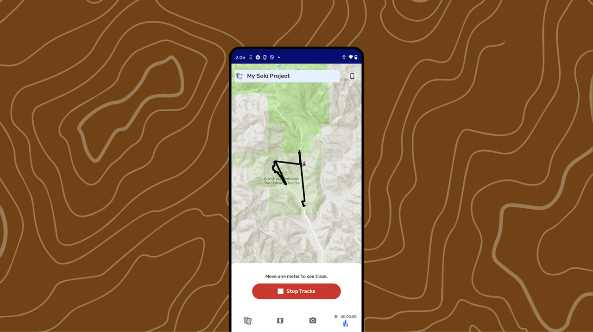
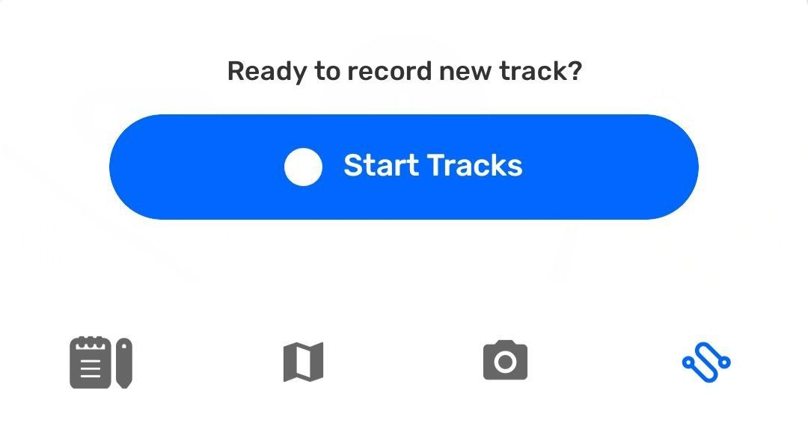
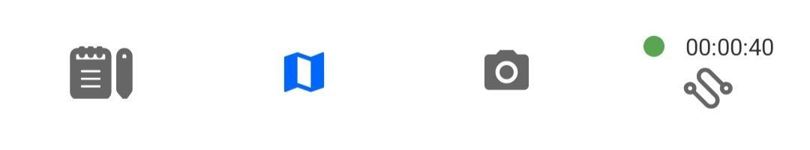
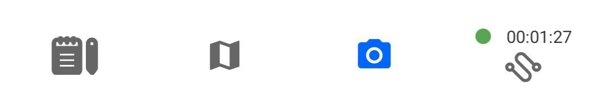
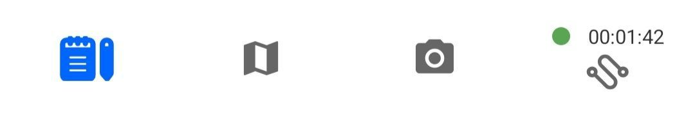
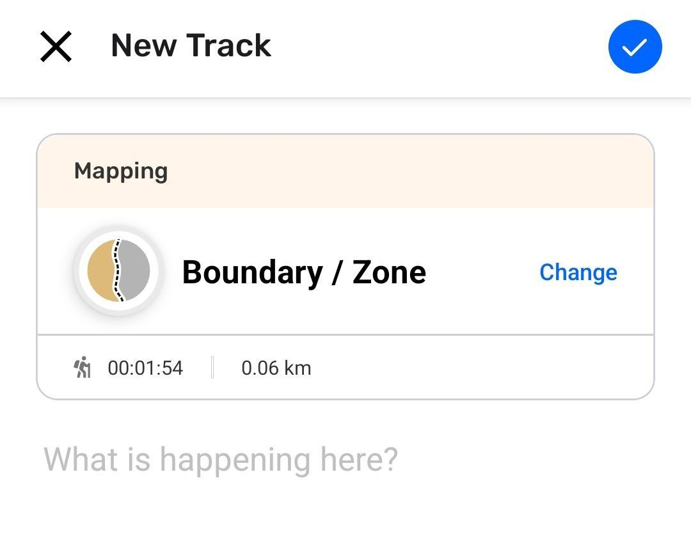

---

---

Para CoMapeo Mobile v8

# Criando uma Nova Trilha

## O que é uma Trilha?

Uma **Trilha** registra seu movimento no mapa como se fosse uma linha. As trilhas são úteis para documentar saídas de campo, rotas de monitoramento ou qualquer caminho que você queira salvar e acessar depois. Elas são úteis para mapear caminhos, rios, fronteiras ou rotas de patrulha.

Assim como as observações, as trilhas estão associadas ao projeto em que são criadas.

## O que é esperado ao criar uma trilha?

O CoMapeo registra isso apenas com a permissão do dispositivo para acessar suas informações de localização **o tempo todo.**

Durante a gravação da trilha, informações adicionais são exibidas:

- A trilha é indicada por uma linha tracejada azul no mapa.

- Indicador de gravação com o tempo e distância percorridos anexado à sua posição no mapa.

- O indicador de gravação com tempo decorrido é adicionado à aba de trilhas.

---

:::::note 👣
### Passo a passo

***Passo 1:*** Abra a aba **Trilhas**

:::note 👉🏽 Mais
Na primeira vez que este recurso for usado, o Android solicitará uma alteração da permissão de localização para usar o recurso. O aplicativo pode solicitar permissão de GPS.
Vá para 🔗[Soluções Comuns - Permissão de dispositivo para CoMapeo Mobile](/pt/docs/common-solutions#solution-check-app-permissions) para saber mais.

:::

---

***Passo 2:*** Toque em **Iniciar Trilha** para começar a gravar seu caminho.

---

***Passo 3:*** Conforme você se move, o CoMapeo desenhará uma linha no mapa ao longo do caminho.
A trilha continuará sendo gravada enquanto você usa outros recursos simultaneamente no CoMapeo, usa outros aplicativos e até mesmo quando bloqueia a tela para economizar bateria.

::::note 💡 Dica
Use a aba na parte inferior para navegar entre as ferramentas, para criar ou revisar observações enquanto grava uma trilha.

::::

---

:::note 👉🏽 Mais
Todas as observações coletadas enquanto uma trilha está sendo gravada, serão vinculadas à trilha para fácil identificação, quando for acessá-la novamente.

:::

---

***Passo 4:*** Quando concluído, reabra o Trilhas e toque **Parar Trilha**.

---

***Passo 5:*** Selecione a categoria que melhor descreve o que a trilha representa

***Passo 6:*** Adicione uma descrição útil e toque em **Salvar**

:::::

---

## Interrompendo uma Trilha

A maneira esperada de finalizar a gravação de uma trilha é selecionandoParar eSalvar. No entanto, há duas situações que desencadearão uma interrupção na gravação:

- Aceitar um Convite de Projeto enquanto a gravação de trilha está ativa

- Alterar projetos enquanto a gravação de trilha está ativa

Em ambos os casos, há um prompt com duas opções

**Cancelar** para permanecer no projeto onde a trilha está sendo gravada, ignorando a interrupção.

**Parar trilha** sem salvar, para prosseguir com a alteração de projetos ou aceitar o convite.

---

## Conteúdo Relacionado

Vá para 🔗[Explorando a Lista de Observação](/pt/docs/exploring-the-observations-list)

## **Tendo problemas?**

🔗 Ir para[Solução de Problemas: Observações e Trilhas](/pt/docs/troubleshooting-observations-and-tracks)

