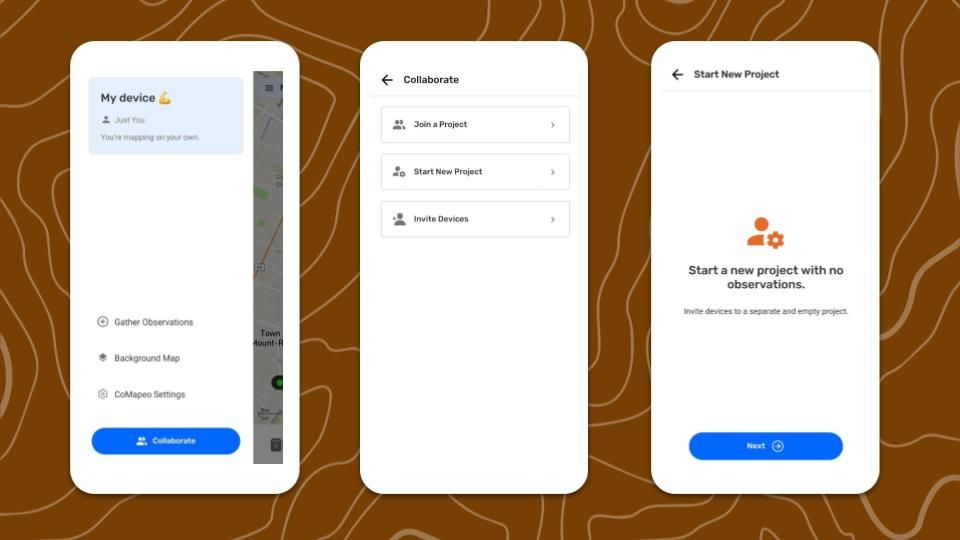

## Starting a New Project

A new Project, will start with no observations, the CoMapeo Categories, and default Background Map. 

:::note 👣
### Step by Step

***Step 1:*** Go to the **Menu**.

***Step 2:*** Tap on  **Collaborate**.

***Step 3:*** Select  **Start New Project.**

***Step 4:*** Add a **project name** and continue

***Step 5:*** Select a  **Project Statistics** option. This can be changed in Coordinator Tools

***Step 5:*** Your new project is ready! 

:::

:::note 💡 Tip
The project that you started when first onboarding onto CoMapeo will still be available go back to

:::

The device that creates the New Project is the Coordinator and has access to new menu options.  Teams and  Coordinator Tools will appear in the Menu

Go to 🔗 [Inviting Collaborators](/pt/docs/inviting-collaborators) for instructions on inviting new devices to the team

## Coordinator tools

###  Project info

- **Name** 

- **Description -** A description can be added to articulate the project purpose or objectives for all teammates to refer to as needed

- **Color**

###  Remote Archive

Optional tool to use a local server as a backup

Go to 🔗 [Using a Remote Archive](/docs/using-a-remote-archive) 

###  Project Categories

Displays details for current **Categories Set**

Go to 🔗 [Changing Categories Set](/pt/docs/changing-categories-set)  

### **Project Statistics**

Setting for sharing anonymized analytic information for improving development of CoMapeo

## Related Content

Go to 🔗 [Planning and Preparing for a Project](/pt/docs/planning-and-preparing-for-a-project) 

Go to 🔗 [Selecting Device Roles and Teams](/pt/docs/selecting-device-roles-and-teams) to learn about making your project collaborative 

Go to 🔗 [Understanding How Exchange Works](/pt/docs/understanding-how-exchange-works) for full explanation 

### Having Trouble?

Go to 🔗 [Troubleshooting: Mapping with Collaborators](/pt/docs/troubleshooting-mapping-with-collaborators) 

