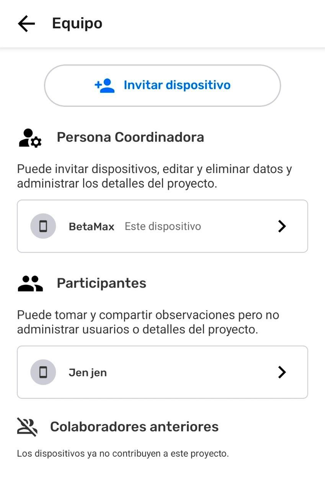
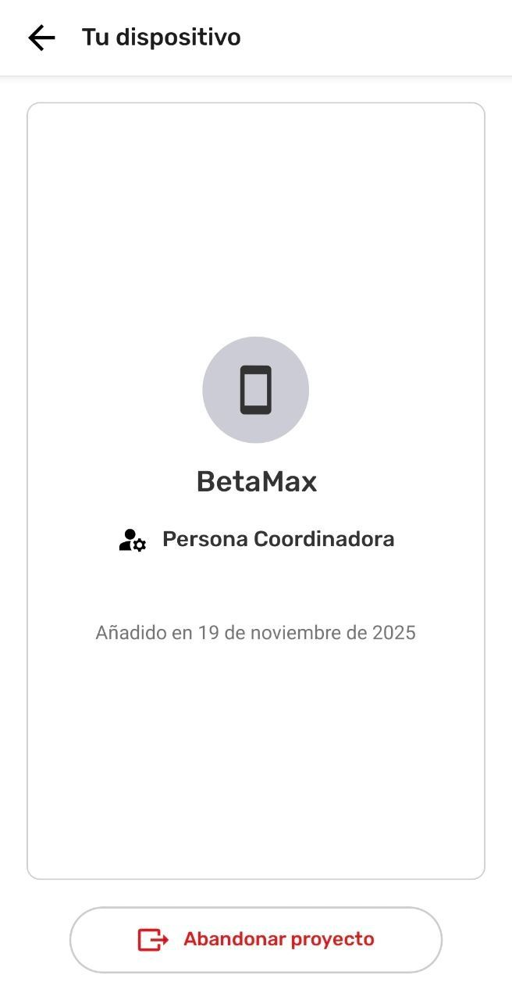
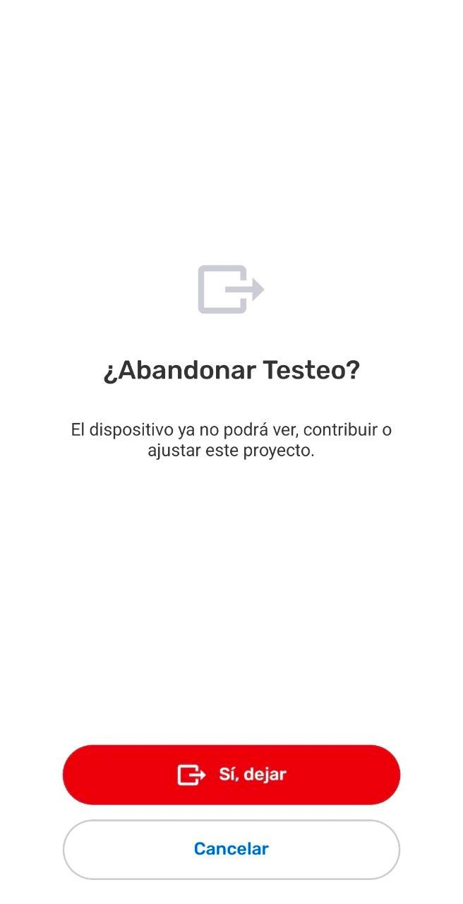
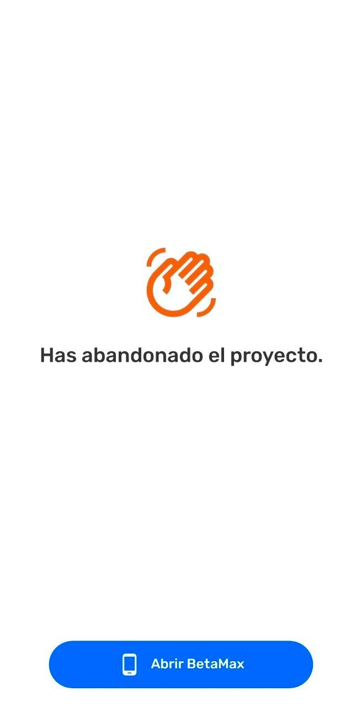
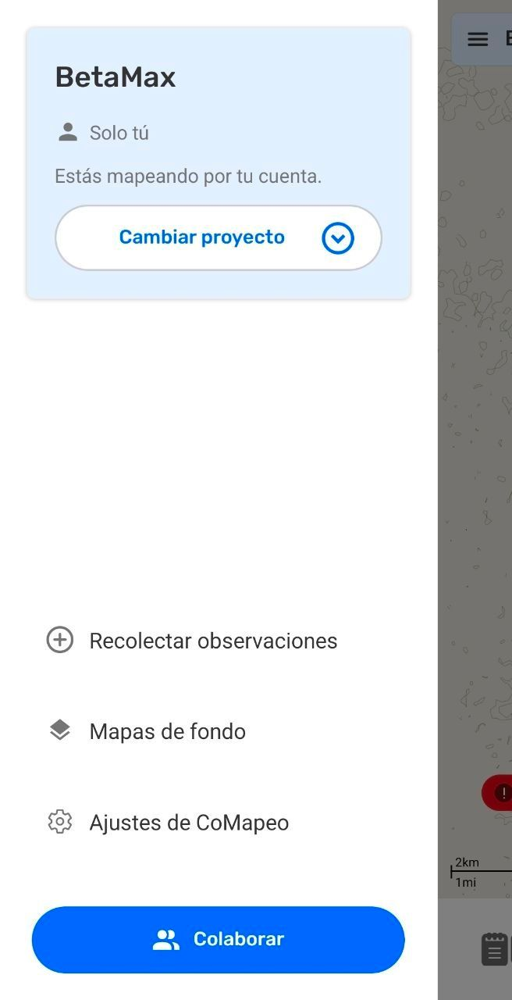

## About Ending Projects in CoMapeo

Ending an offline project is a task with theoretical possibility due to the features included in CoMapeo, but possibly imperfect in execution depending on the team using CoMapeo, and the context they are working in. 

It is also notable that ending a project **does not remove any gathered information from any device**.  Much like share knowledge between people, CoMapeo information is not erased, but can be forgotten about.

Ending a project successfully is a matter of coordinating actions amongst the team rather than a single task. This is because CoMapeo uses a decentralized structure to store and exchange information across every device in a project. The nature of decentralized systems is that they are remarkably resilient because every device is a back-up. Ending a project is an attempt to disconnect all the backups from each other.

:::note ⚠️ Warning
In a project where there is no remote archive and teammates are not connecting to the same router, there is no way to 100% confirm that all devices have left or been removed.

:::

## Preparing to End a Project

To end a project in CoMapeo, the best practice is to archive all data and then for all team members – devices listed within the  **Team** – to leave the project, with a coordinator being the last to leave. 

### Plan Data Archiving

It is good practice for a project to end with a properly archived database. 

### Clear out devices from the Team

> [!NOTE]
> Unsupported Notion block: `heading_4`

Everyone on the team but one coordinator leaves the project.

After leaving a project, if those are able to connect to the same wifi as the coordinator, the team list will be updated as a confirmation that others have left the project. 
Go to 🔗 [Leave a Project](/pt/docs/leave-a-project) to learn more.

> [!NOTE]
> Unsupported Notion block: `heading_4`

A coordinator removes all participants and other coordinators from the project.
Go to 🔗 [Removing a device from a Project](/pt/docs/removing-a-device-from-a-project) to learn more.

:::note ⚠️ Warning
The devices removed need to be connected to the same Wi-Fi router or have Remote Archive set up in order to receive the removal notification. If this does not happen, the removed devices  will continue in the project until the next time they connect with a different device in the project that has updated project information .

:::

:::note 💡 Tip
If the goal is to allow for the sole Coordinator to leave the project but also maintain the project as fully active, a different Coordinator device must be invited before the last Coordinator abandons the project.

:::

## **Abandoning a project**

The last  **Coordinator** to  L**eave Project** is abandoning the project.  The project will no longer have a Coordinator, leaving as what can be described as a headless project. That project may have  **Participants** who can still  **Exchange,** but they cannot access  **Coordinator Tools** nor Invite nor remove other devices.

::::note 👣
### Step by Step

***Step 1:*** In the **Menu**, select  Team.

---

***Step 2:***  Select **This device**. The device in use should be the only one listed as a coordinator.

---

***Step 3:*** Select  **Leave Project.**

---

***Step 4:*** Review and consider recommendations before selecting  **Continue**

---

***Step 5:*** If prepared to abandon the project, select  **Yes, Leave**

---

***Step 6:*** This device has left the project. Start **Mapping on your own** by opening the project with the **Device Name**.

---

***Step 7:*** To continue **Mapping on your own** create at least one observation. Otherwise Select  **Switch project.**

:::note 👉🏽 More
When changing project without adding an observation to the Mapping on your own project named with the device name will not save and will not appear on the list of projects.

:::

---

***Step 8:*** Open the desired project

::::

## Related Content

Go to 🔗 [Understanding Projects](/pt/docs/understanding-projects)

Go to 🔗 [Leave a Project](/pt/docs/leave-a-project) 

Go to 🔗 [Removing a device from a Project](/pt/docs/removing-a-device-from-a-project)

### **Having problems?**

Go to 🔗 [Troubleshooting: Mapping with Collaborators](/pt/docs/troubleshooting-mapping-with-collaborators)

