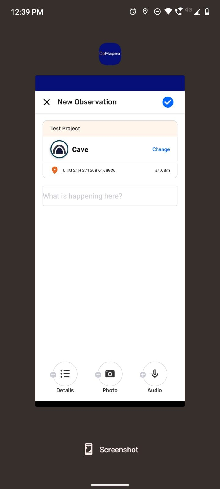
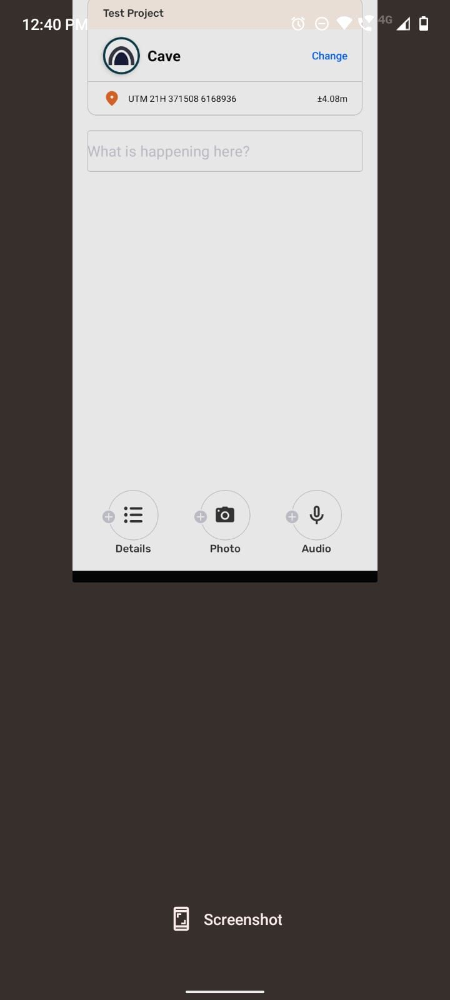
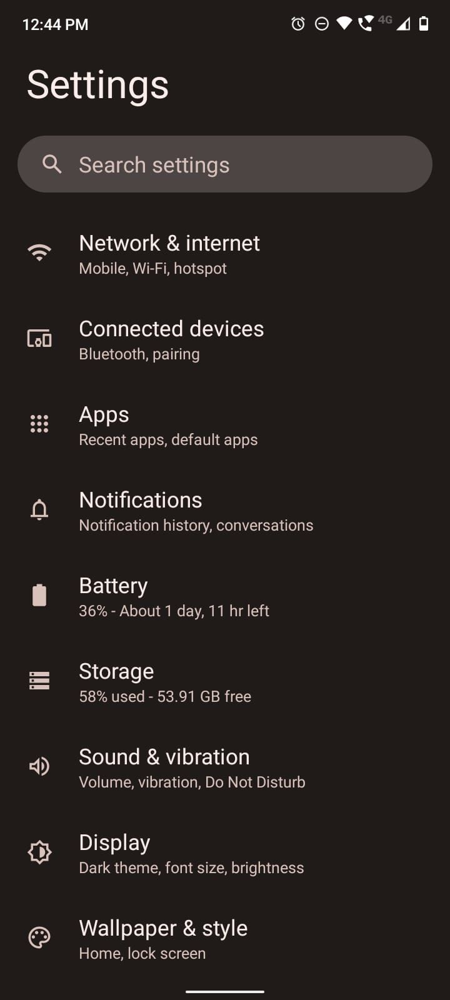
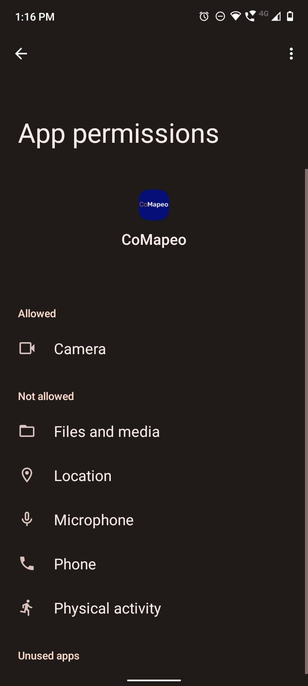
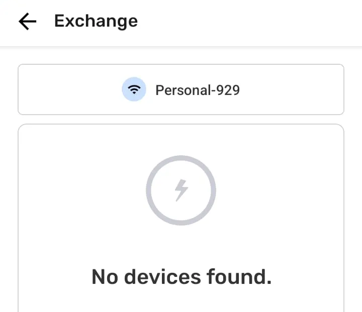

---

## Sobre Soluções Comuns

Esta página oferece soluções rápidas e detalhes adicionais sobre por que elas tendem a funcionar. Essas soluções provavelmente não resolvem a causa raiz do problema nem evitam que ele aconteça novamente, mas são úteis para manter os fluxos de trabalho em andamento.

### 🟩 Solução: Fechar & **Reiniciar CoMapeo**

Às vezes, o CoMapeo pode apresentar falhas após permanecer aberto por muito tempo; isso pode ocorrer por diversos motivos. Por exemplo, o celular pode estar com pouca memória ou o aplicativo pode ter entrado em um estado instável.

**👣 Instruções passo a passo**

***Passo 1:*** Deslize para cima a partir da parte inferior enquanto o CoMapeo está selecionado, para ver todos os aplicativos abertos no telefone.

***Passo 2:*** Deslize para cima novamente, centralizando seu dedo no **CoMapeo** para fechá-lo

***Passo 3:*** Vá para o ícone do **CoMapeo** na sua tela principal ou no menu da tela de aplicativos e selecione **CoMapeo**

### 🟩 Solução: Certifique-se de que seu dispositivo tenha espaço livre suficiente disponível

Existem diferentes cenários em que a falta de espaço disponível no seu dispositivo pode causar problemas. Por exemplo, ao criar uma nova observação ou ao trocar dados coletados com colaboradores.

**👣 Instruções passo a passo**

***Passo 1:*** Vá para a tela de Configuração do Android (⚙️)

***Passo 2:*** Veja o armazenamento disponível. O Android tentará mostrar quais tipos de arquivos estão consumindo mais armazenamento. Assim, por exemplo, se a maior parte do espaço estiver preenchida com vídeos ou imagens, pode-se ir ao Gerenciador de Arquivos do Android (📁) e excluir arquivos para que haja espaço livre para novos dados coletados (do usuário ou trocados com colaboradores).

👉 O **CoMapeo** tentará ao máximo informar ao usuário que o dispositivo está com pouco armazenamento, permitindo a exclusão de conteúdos no dispositivo e a liberação de espaço para novos dados.

### 🟩  Solução: Reiniciar Dispositivo

Quando os dispositivos ficam ligados por muito tempo (como, meses), eles podem começar a gerenciar mal os recursos (como a memória). Isso pode acontecer mais se houver muitos aplicativos abertos. Em geral, isso não deveria acontecer, mas reiniciar o dispositivo pode evitar problemas em certas situações.

**👣 Instruções passo a passo**

***Passo 1:***Mantenha pressionado o*dispositivo de bloco*botão que geralmente está localizado em um lado do telefone. É bastante comum que os dispositivos tenham três botões: dois botões para diminuir e aumentar o volume, e um botão para bloquear (desligar a tela) o dispositivo.

***Passo 2:***Pressione o**Reiniciar**botão para que o telefone reinicie sozinho
***Passo 3:***Aguarde até que o telefone reinicie e reabra**CoMapeo**

👉 Informações complementares para prevenção ou redução de problemas

### 🟩  Solução: Verificar permissões do aplicativo

**CoMapeo**precisa de um conjunto de permissões para funcionar corretamente. Essas permissões garantem que o aplicativo tenha acesso a diferentes recursos do telefone. Principalmente, acesso ao**câmeraGPS**dispositivo e o**microfone**. Exceto algumas exceções, o aplicativo só precisa dessas permissões enquanto está em foco, então ele pede especificamente por esse tipo de permissão (acesso durante o uso do aplicativo).

Ao abrir o aplicativo pela primeira vez,**CoMapeo**solicitará as permissões mínimas necessárias para seu uso correto. Estas são, permissão para usar o**Câmera**e permissão para acessar o**GPS**Pode acontecer que o usuário não tenha concedido algumas ou todas essas permissões ao aplicativo, o que significa que o aplicativo não funcionará corretamente. Se for esse o caso, toda vez que você reiniciar (ou reabrir) o aplicativo,**CoMapeo**solicitará essas permissões novamente. Para reiniciar o aplicativo, consulte🟩 Solução: Feche e Reinicie o CoMapeo

### Permissão de dispositivo para o CoMapeo Mobile

| **Tipo de Permissão de Dispositivo** | **Uso no CoMapeo** | **Permissão necessária** |
| --- | --- | --- |
| Câmera | Para tirar fotos | enquanto o aplicativo está sendo usado |
| GPS | Coordenadas salvas com Observações | enquanto o aplicativo está sendo usado |
| GPS | Gravar faixa enquanto usa outros recursos ou aplicativos,e o telefone está em espera | o tempo todo |
| Áudio | Gravação de áudio | enquanto o aplicativo está sendo usado |

Para verificar se você tem as permissões suficientes para o uso correto de**CoMapeo**, faça os seguintes passos:

**👣 Instruções passo a passo**

***Passo 1:***Vá para a tela de Configuração do Android (⚙️)

***Passo 2:***Vá para o menu Aplicativos

***Passo 3:***Procure por**CoMapeo**na lista de aplicativos (você tem uma barra de pesquisa para encontrá-lo rapidamente)

***Passo 4***Na tela de informações do aplicativo, selecione o**Permissões**item

***Passo 5:***Lá, você verá uma lista de**Permitido**e**Não permitido**permissões. Clicar em um item específico (como Câmera), mostrará o tipo de permissão concedida a esse item e permitirá que o usuário selecione um tipo de permissão diferente

***Passo 6:***Corresponder às permissões detalhadas na lista acima pode resolver problemas relacionados a**permissões**

### 🟩  Solução: Verifique se todos os dispositivos estão na mesma rede WiFi

Existem vários problemas que podem ser resolvidos verificando se você está na mesma rede Wi-Fi que outros dispositivos. Esse problema pode aparecer quando:

- Tentando convidar colaboradores para uma equipe

- Tentando trocar dados coletados

### 🟩  Solução: Verifique se todos os dispositivos estão realmente conectados à rede WiFi

Ao trocar dados coletados no CoMapeo, é um caso bastante comum que o dispositivo que fornece a rede (por exemplo, um celular ou um roteador) não tenha conexão com a internet. Isso pode acontecer porque você está em uma área com baixo sinal de celular, ou porque o roteador designado para a troca naquele espaço não está conectado à internet.
Os celulares podem optar por desconectar automaticamente de uma rede que não tenha conexão com a internet, o que pode conflitar com várias funcionalidades de**CoMapeo**(como convidar colaboradores para um projeto, ou trocar dados coletados).
Para garantir que o dispositivo esteja realmente conectado à rede desejada, verifique as seguintes instruções

**👣 Instruções passo a passo**

***Passo 1:***Ao conectar-se à rede, preste atenção a um aviso que pode aparecer. Ele informará que a rede não tem acesso à internet e perguntará se você deseja manter-se conectado à rede. Selecione**SIM**
***Passo 2:***Verifique se o dispositivo está realmente conectado à rede desejada. Você pode verificar o ícone de WiFi na parte superior da tela, e se a rede não tiver acesso à internet, geralmente mostrará um ponto de exclamação ao lado do ícone de WiFi.
👉🏽Às vezes, o prompt de**Passo 1**pode não aparecer. Para forçar essa mensagem, pode ser necessário ir para as configurações de WiFi no telefone e isso forçará o prompt a aparecer

## Explore a solução de problemas do Pages

Navegue por problemas específicos e aprenda como evitá-los no futuro. Explore as páginas de solução de problemas selecionando o tópico específico em questão.

A equipe de Ajuda do CoMapeo atualiza estas páginas à medida que problemas e soluções surgem.

---
:::note 📨
## **Contato**a Equipe de Ajuda do CoMapeo

Se você não conseguiu resolver os problemas com os recursos compartilhados no[Páginas de Ajuda do CoMapeo](/pt/docs/introduction)por favor, entre em contato conosco. Alguém da Awana Digital ficará feliz em receber detalhes sobre sua experiência, incluindo capturas de tela para ajudar a explicar o que não está funcionando conforme o esperado
📧 Envie-nos um e-mail para[help@comapeo.app](mailto:help@comapeo.app)

💬 Você também pode conversar conosco no[Discord](https://discord.gg/kWp34am3)

:::

---

