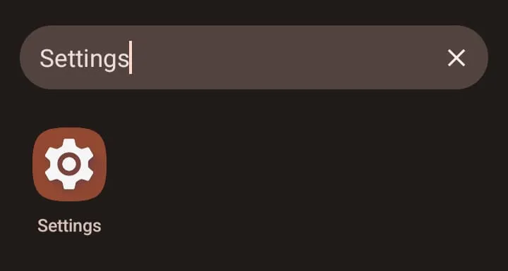
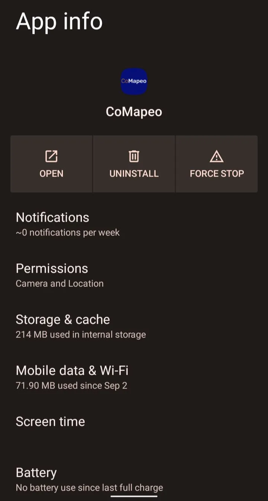
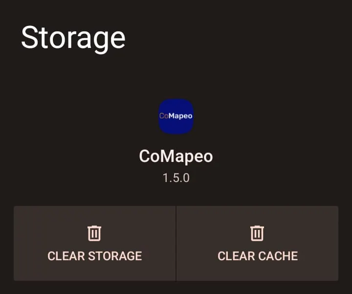

---

Conceito geral e uso desta página

Este guia ajudará você a diagnosticar e resolver problemas comuns de forma sistemática. Siga as etapas em ordem para a resolução mais eficiente do problema.

---

## Instalação e Problemas de Inicialização

### Não é possível iniciar o CoMapeo

✅**Verifique se você tem** **CoMapeo instalado no seu telefone ou computador.** Siga as instruções em [Instalando o CoMapeo](/pt/docs/installing-comapeo-and-onboarding).

### 🟩**Solução: Limpar dados do cache do aplicativo (somente CoMapeo Mobile)**

No CoMapeo Mobile, você pode limpar o cache do aplicativo usando as configurações do sistema Android. Os aplicativos normalmente usam o cache para armazenar dados não permanentes para melhorar a experiência do aplicativo e geralmente é seguro remover esses dados. Limpar esse cache pode resolver problemas ao iniciar o CoMapeo.

:::note ⚠️ Aviso
Os dados do CoMapeo, incluindo personalizações e dados coletados, serão excluídos se os dados de armazenamento forem limpos. Tenha cuidado, certificando-se de selecionar apenas **cache** ao limpar dados em cache.

:::

**👣 Instruções passo a passo**

***Passo 1:*** Vá para as configurações do Android. Você pode encontrá-las indo para o menu principal do Android e procurar por "Configurações". Geralmente tem um ícone de *engrenagem* (⚙️).

***Passo 2:*** Abra-o e, dentro dele, procure pela opção "Apps". Isso exibirá todos os aplicativos instalados no dispositivo. Geralmente, há uma barra de pesquisa onde você pode digitar

***Passo 3:*** Digite **CoMapeo** e clique nele

***Passo 4:*** Uma vez dentro das *Informações do aplicativo*, selecione *Armazenamento & Cache*

***Passo 5:*** Dentro de *Armazenamento* selecionar *LIMPAR CACHE* que tem um ícone de lixeira (🗑️). Como dito acima, **cuidado nesse passo e selecione apenas** ***LIMPAR CACHE*** **e não** ***LIMPAR ARMAZENAMENTO*** **já que isso excluirá todos os dados, basicamente redefinindo o CoMapeo como se você acabasse de instalá-lo.**

***Passo 6:*** Uma vez que os dados do cache são limpos, abra o aplicativo novamente.

### 🟩**Solução: Ver** [Soluções Comuns - 🟩 Solução: Certifique-se de que seu dispositivo tenha espaço livre suficiente disponível](/pt/docs/common-solutions#solution-make-sure-your-device-has-enough-free-space-available)

:::note 💣
**Ainda não está funcionando?**

**Desinstale e reinstale o aplicativo.**

É importante observar que desinstalar o CoMapeo significa **perder todos os dados que você coletou até agora**. Você só pode recuperar esses dados se tiver trocado anteriormente com outro dispositivo.

:::

---

## Problemas de configuração do aplicativo

### Não é possível iniciar o CoMapeo

### O nome do dispositivo não está aparecendo conforme o esperado

A única maneira de alterar um nome de dispositivo para uso no CoMapeo é usar esse mesmo dispositivo e acessar  Configurações do CoMapeo → Nome do Dispositivo.

Verifique a segurança física do seu dispositivo para identificar vulnerabilidades das quais você pode não estar ciente.

🟩**Solução: Confirme a segurança do bloqueio do seu dispositivo**

Se você tem um dispositivo compartilhado, confirme com as pessoas ao seu redor quais aplicativos são compartilhados. Não é incomum que crianças curiosas brinquem com aplicativos fáceis de usar.

🟩**Solução: Adicionar um Código de Acesso seguro ao CoMapeo**

Acesse: 🔗[Usando um Código de Acesso do Aplicativo para Segurança](/pt/docs/using-an-app-passcode-for-security)

---

## Problemas de Conjunto de Categoria Personalizada

### 🟩**Solução: Verifique se você está carregando o arquivo correto**

Ao carregar um conjunto de categorias personalizado, o aplicativo pode falhar ao carregá-lo. Isso pode acontecer por vários motivos

Os arquivos de categorias do **CoMapeo** têm uma extensão chamada ***.comapeocat.*** Então você precisa  garantir que está carregando o arquivo correto.

**👣 Instruções passo a passo**

**Passo 1:** Depois de selecionar o botão *Importar Categorias*, o navegador Android aparecerá para você selecionar o arquivo de categoria pretendido. Mas pode acontecer que o nome do arquivo seja cortado, então você pode não conseguir ver o nome completo.

**Passo 2:** Se você quiser ter certeza de que está selecionando o arquivo correto, pode selecionar e segurar o dedo em cima do arquivo desejado, o que mostrará o nome correto e selecionará esse arquivo.

**Passo 3:** Se o arquivo selecionado for o desejado, pressione selecionar no canto superior direito

### 🟩**Solução: Certifique-se de ter um arquivo de categorias compatível com a versão instalada do CoMapeo**

De outubro a novembro de 2025, lançamos uma versão do CoMapeo (**v7**) que alterou o formato para conjuntos de categorias personalizados. Isso significa que se você criou um arquivo de categorias antes de outubro de 2025 e tentou carregá-lo na **v7** do CoMapeo ou outra versão mais recente,  o aplicativo pode falhar ao carregar o arquivo.

**👣 Instruções passo a passo**

***Passo 1:*** Abra o **CoMapeo,** e vá para o menu **Configurações do Comapeo** e escolha **Sobre o CoMapeo** no menu.

***Passo 2:*** Verifique a **Versão do CoMapeo** e identifique se a versão é maior ou igual a **7.0**

***Passo 3:*** Verifique a data em que o arquivo de categorias foi criado. Isso pode ser feito a partir de um computador desktop verificando as propriedades do arquivo.
***Passo 4:*** Se o arquivo foi criado **antes de** Outubro de 2025, então é possível que o arquivo de categorias seja incompatível com sua versão atual do **CoMapeo**
***Passo 5:*** Crie um novo arquivo de categorias que seja compatível com a versão atual do **CoMapeo.** Para isso, acesse: [Construindo um Conjunto de Categorias Personalizado](https://notion.so/docs/building-a-custom-categories-set)
👉 Uma alternativa, mas um problema similar que pode ocorrer é ter uma versão mais antiga do **CoMapeo** (mais antigo que **v7**) e tentar carregar um arquivo de categorias personalizado que é mais recente do que essa versão, o que também falhará. A melhor solução para esse caso é atualizar a versão instalada do **CoMapeo**

---

## 🔗 Site do CoMapeo

---

:::note Acesse [comapeo.app](http
//comapeo.app/) para obter informações gerais, inscrever-se na newsletter e acessar blogs sobre o CoMapeo.

:::

:::note
## 📨 **Entre em contato** com a equipe de suporte do CoMapeo

Se você não conseguiu resolver os problemas com os recursos compartilhados nas  [Páginas de Ajuda do CoMapeo](/pt/docs/introduction), entre em contato conosco. Alguém da Awana Digital terá prazer em receber detalhes sobre sua experiência, incluindo capturas de tela, para ajudar a explicar o que não está funcionando como esperado
📧 Envie-nos um e-mail para [help@comapeo.app](mailto:help@comapeo.app)

💬 Você também pode conversar conosco no  [Discord](https://discord.gg/kWp34am3)!

:::

---

