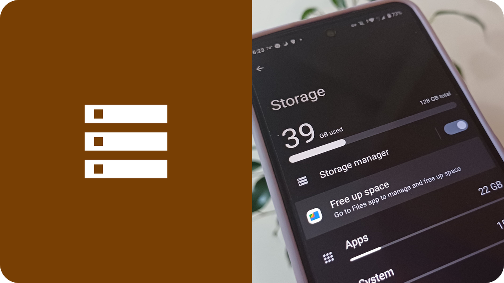
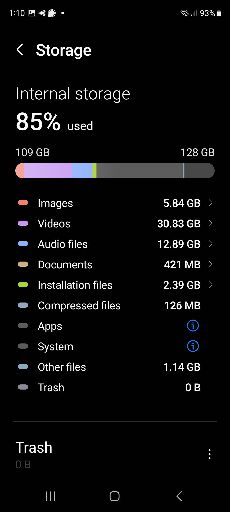
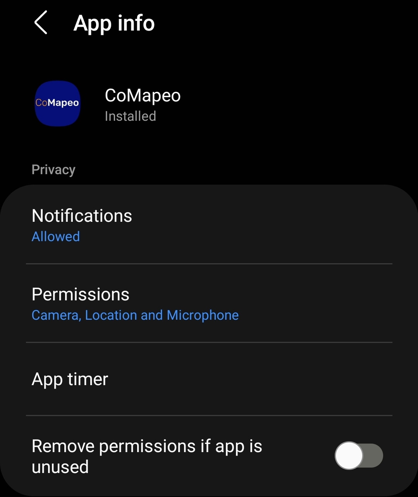
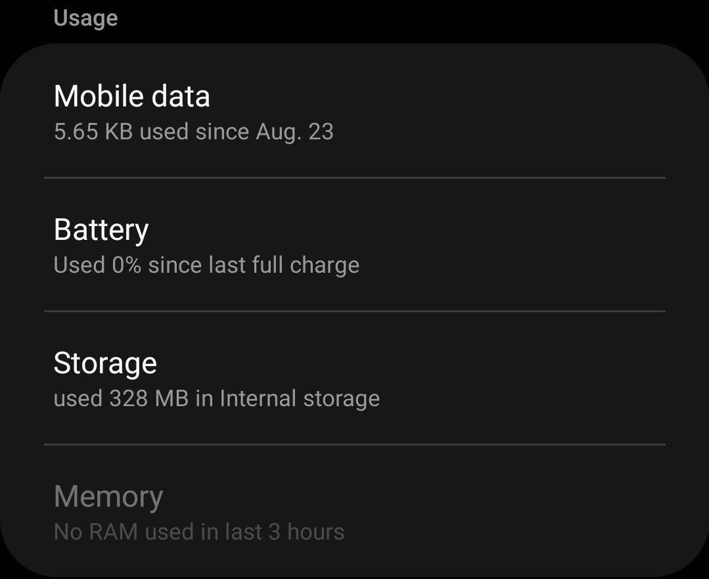

---

### Por que é importante fazer a manutenção do meu dispositivo?

Cuidar do seu dispositivo móvel (celular) ou computador para mantê-lo bem conservado ajuda a mantê-lo rápido, seguro e livre de problemas de desempenho em seu funcionamento.

:::note 💡 Dica
Considere realizar as etapas abaixo para otimizar seu dispositivo móvel para usar o CoMapeo.

:::

:::note 🚧
Recomendações para computadores e uso do CoMapeo Desktop em breve.

:::

# Configurando seu dispositivo para usar o CoMapeo Mobile

Aqui você aprenderá o que fazer no seu smartphone android ou tablet  (fora do CoMapeo) para obter o melhor desempenho dele conforme você começa a usá-lo.

### ✔️ Lista de verificação

::::note ✅ Ligue o GPS
Certifique-se de que a Localização / GPS esteja **ativada** no seu celular. Geralmente, você pode encontrar isso no menu de acesso rápido, acessado ao puxar para baixo a partir do topo da tela.

---

::::

:::note ✅ Verifique a duração da bateria
Para otimizar a duração da bateria durante a coleta de dados, use o **modo avião**. Se possível, leve uma bateria externa e um cabo de carregamento do celular para recarregar enquanto estiver em campo. Também tente garantir que outros aplicativos não estejam sendo executados em segundo plano, consumindo sua bateria.

:::

::::note ✅
**Gerencie o armazenamento**

O CoMapeo não é um aplicativo grande, e os dados de observação (coordenadas de GPS e anotações) não ocupam muito espaço. No entanto, se você começar a tirar muitas fotografias ou gravar áudios, isso pode começar a encher a sua memória.

- Gerencie o uso do seu armazenamento excluindo aplicativos indesejados em Configurações > Aplicativos > Ordenar por "Último uso" ou "Tamanho".

- Se houver muitas fotos e vídeos na galeria do seu celular, considere movê-los para um dispositivo de armazenamento de mídia diferente.

::::

---

### Boas práticas de manutenção para seus celulares

:::note 🔒
**Proteja seu telefone**

- Certifique-se de ter um PIN, senha, padrão de desenho ou impressão digital fortes para desbloquear a tela — para manter os dados do CoMapeo seguros caso você perca o celular ou ele caia em mãos erradas.

- Você também pode proteger o acesso ao CoMapeo definindo um código de acesso do app: veja **Trabalhando com um Código de Acesso do App.**

:::

---

::::note ✅
**Mantenha seu sistema operacional atualizado**

***Passo 1:*** Vá para Configurações

***Passo 2:*** Toque em Atualização de Software

::::

---

::::note ✅
**Mantenha seus aplicativos Android atualizados**

***Passo 1:*** Abra a Play Store

***Passo 2***: Abra o menu principal (sua foto de perfil do Google)

***Passo 3:*** Selecione **Gerenciar apps e dispositivos**

***Passo 4:*** Selecione uma configuração de atualização preferida.
Se você tem bom acesso à internet, selecione “Atualizar tudo”. Se você tem acesso limitado à internet, selecione “Ver detalhes” para atualizar manualmente aplicativos específicos que você usa regularmente. Lembre-se de selecionar o CoMapeo.

::::

:::note 👀
**Pratique uma rotina regular de manutenção**

✔️ Reinicie / reinicialize seu telefone

✔️ Execute uma verificação de malware

✔️ Verifique seu armazenamento

✔️ Verifique o uso da bateria

[Embedded content](https://lh7-rt.googleusercontent.com/docsz/AD_4nXfFZB09c6KVbsCbBFM0SIh3KF_nZJFlirtp6H3lg08iXoIvBBY8z56wjsCmmUquMYBKfdzjL66R2Iz3stX_FIwN0V3DLzrJaqNXq_McwLaAH605Z4Yu7JbvtEwHjoEOlNrPmGU7Bw?key=gp1SR_ESd4345K1Ci1LIHQ)

:::

### Proteja seu celular contra danos físicos

**Capas para smartphone.**

Escolha uma capa que ofereça proteção contra exposição à água, quedas acidentais e abrasão em geral. Recomenda-se adicionar um protetor/película na tela do celular.

**Considerações sobre tempo e clima.**

Experiências comuns de uso de smartphone em ambientes de alta exposição

- Calor excessivo → O dispositivo superaquece e desliga

- Frio extremo → Drenagem acelerada da bateria

- Alta umidade → Corrosão acelerada de partes do dispositivo, especialmente portas de carregamento

- Chuva → A umidade pode infiltrar-se nas portas, afetando as portas de carregamento e, em casos graves, os chipsets dentro do dispositivo

---

### Examine o CoMapeo Mobile no Android

Para saber mais sobre o espaço e as permissões que estão sendo usados pelo CoMapeo, abra a tela de Gerenciamento de aplicativos do CoMapeo Mobile

::::note 👣
Configurações do Android → Gerenciamento de aplicativos → CoMapeo

::::

::::note 💡 Dica
Se o CoMapeo estiver na tela inicial, **pressione e segure o ícone do CoMapeo** para abrir as opções do aplicativo. Selecione  **informações** para ir para a tela de Gerenciamento do App do CoMapeo Mobile

::::

## Conteúdo relacionado

Vá para 🔗[Instalando o CoMapeo e o Onbo](/pt/docs/installing-comapeo-and-onboarding)[arding](/pt/docs/installing-comapeo-and-onboarding)

### Está com problemas?

Vá para 🔗[Solução de problemas: Configuração e personalização](/pt/docs/troubleshooting-setup-and-customization)

---

