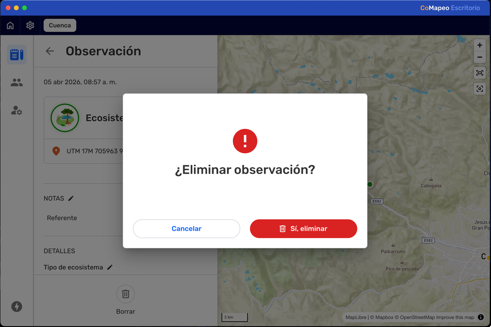
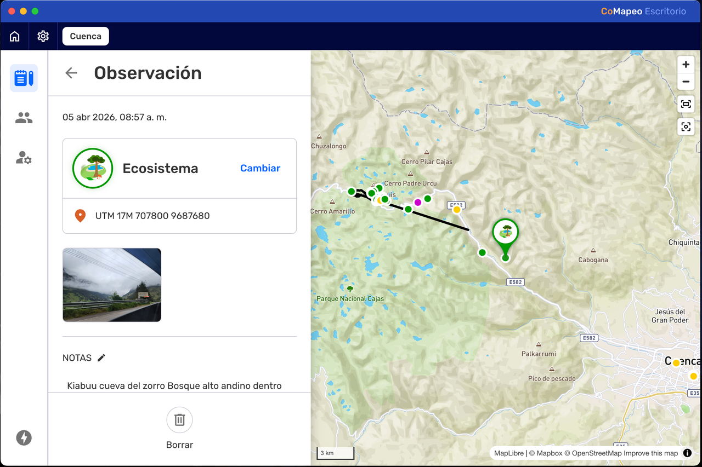
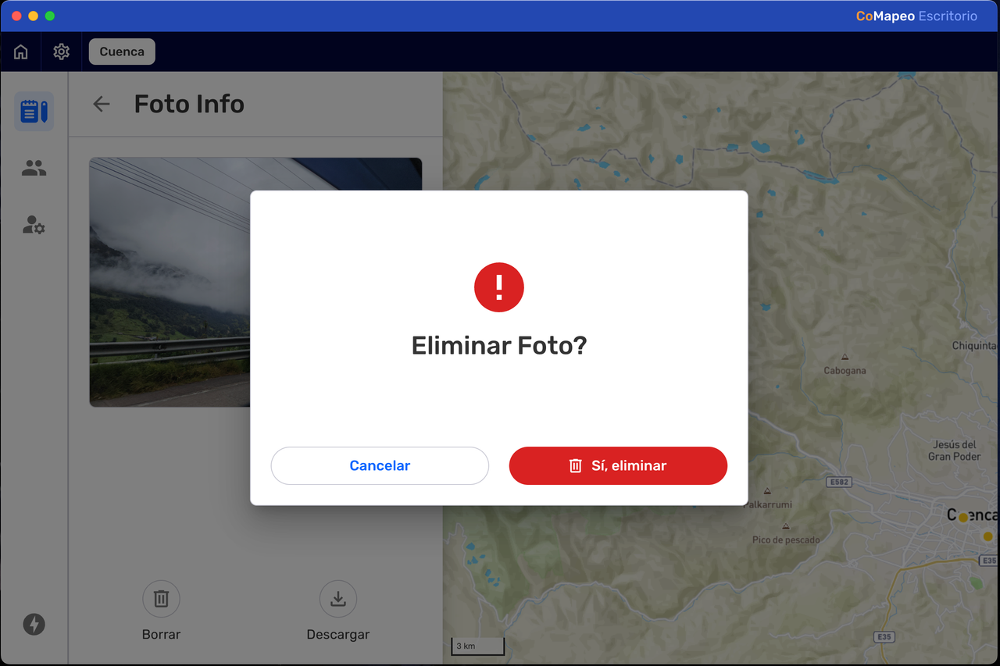
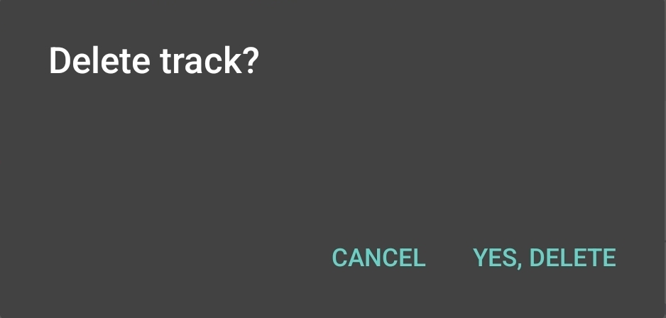

---

## O que é a função Excluir no CoMapeo?

**Excluir** é um tipo específico de edição que oculta observações e percursos da visualização dentro de um projeto. Também remove as associações entre os diferentes elementos de dados que compõem as observações e as trilhas.

:::note 👉🏾 Mais
A exclusão de observações não libera espaço de armazenamento no dispositivo. No entanto, pode impedir que outros dispositivos recebam ficheiros multimídia que, de outra forma, ocupariam espaço de armazenamento após a troca.

:::

## Porquê excluir uma Observação ou uma Trilha

Quando uma observação ou uma trilha não tem valor ou é potencialmente prejudicial de alguma forma, deve ser excluída.

- Reduz a inclusão de dados irrelevantes num projeto.

- Oculta informações que podem representar uma ameaça à segurança pessoal ou da equipe

:::note 💡 Dica
Para reduzir o uso de espaço de armazenamento num dispositivo, elimine os ficheiros multimédia inadequados antes de guardar a observação.

:::

## Permissões limitadas para Editar e Excluir

As observações e as trilhas criadas num dispositivo podem sempre ser editadas ou excluídas nesse mesmo dispositivo. Isto significa que o autor pode sempre editar ou eliminar as suas próprias observações e trilhas, desde que não tenha mudado de dispositivo.

Um dispositivo com a função de  **Coordenador** num projeto tem permissão para editar ou excluir todas e quaisquer observações e trilhas nesse projeto. Isto permite que os coordenadores ajudem os participantes a completar ou corrigir informações.

Um dispositivo com a função de  **Participante** num projeto **não** pode editar observações ou trilhas recebidas através da **Troca**.  Na lista de observações, as observações e trilhas recebidas são identificadas com uma linha azul à esquerda.

[image]

:::note 👉🏾 Mais
Estas permissões aplicam-se tanto ao CoMapeo Mobile como ao CoMapeo Desktop.

:::

Acesse 🔗 [Selecionar funções de dispositivos e equipes → Funções disponíveis no CoMapeo](/pt/docs/selecting-device-roles-and-teams#roles-available-in-comapeo) para saber mais.

## Excluindo Observações

::::note 👣
### Passo a Passo - Celular

***Passo 1:*** Revisar a observação para confirmar a decisão sobre deletá-la.

***Passo 2:*** Deslize até o final da observação e clique em  **Excluir**

---

***Passo 3:*** Confirme a exclusão da observação.

:::note ⚠️ Atenção
Depois de excluídas, as fotos e os áudios não podem ser recuperados desse dispositivo. Para cancelar a exclusão, toque em **CANCELAR**.

:::

::::

::::note 👣
### Passo a Passo -  Computador

***Passo 1:*** Clique em   Excluir

---

***Passo 2:***  Confirme a exclusão com  Sim, excluir. 

:::note ⚠️ Atenção
Depois de excluída, uma observação não pode ser recuperada desse dispositivo. Para cancelar a exclusão da fotografia, toque em **CANCELAR**.

:::

---

***Passo 3:*** Retorne para a Lista de observações.

::::

### Excluindo Mídias

A exclusão de fotos ou áudios de uma observação é limitada no CoMapeo.

- No CoMapeo do celular, só é possível excluir mídias enquanto está criando a observação e, antes de salvar.

- Acesse 🔗 [Criar uma nova observação → Excluir uma foto](/pt/docs/creating-a-new-observation#delete-a-photo) para saber mais.

- Acesse 🔗 [Criar uma nova observação → Excluir áudio](/pt/docs/creating-a-new-observation#deleting-audio) para saber mais.

- No CoMapeo Desktop, é possível excluir fotos e gravações de áudio individuais como forma de melhorar a qualidade da informação coletada.

::::note 👣
### Passo a Passo -  Computador

***Passo 1:*** Abra a foto ou áudio selecionando a miniatura.

***Passo 2:*** Clique em   Excluir

---

***Passo 3:***  Confirme a exclusão com  **Excluir Foto**. 

:::note ⚠️ Atenção
Uma vez excluídos, fotos ou áudios não podem ser recuperados do dispositivo. Para desistir da exclusão da foto clique em **CANCELAR.**

:::

---

***Passo*** ***3***: Retorne para as observações.

::::

## Excluindo Trilhas

::::note 👣
### Passo a Passo - Celular

***Passo 1:*** Revise a Trilha para confirmar a decisão de excluir.

***Passo 2:*** Deslize até o final da observação e selecione  **Excluir**

---

***Passo 3:*** Confirme a exclusão da trilha.

:::note ⚠️ Atenção
Uma vez excluídas, trilhas não podem ser recuperadas do dispositivo. Para desistir da exclusão clique em **CANCELAR.**

:::

::::

:::note 👉🏽 Mais
Excluir uma trilha não vai excluir as observações associadas à ela. No entanto, isso irá eliminar a própria associação.

:::

---

:::note ⚠️ Atenção
A edição de trilhas não está disponível neste momento no CoMapeo pra Computador.

:::

## Como funcionam as funções Editar e Excluir durante a Troca

Quaisquer alterações numa Observação ou numa Trilha serão atualizadas em outros dispositivos durante a Troca. Isto inclui categorias e notas editadas, fotos e áudio adicionados, bem como exclusões. O CoMapeo apresentará sempre a versão mais recente disponível de uma observação ou de uma trilha.

Ao trabalhar em equipe, é melhor ter um protocolo acordado para editar, excluir e trocar as informações coletadas. Isto ajudará a evitar conflitos de dados; por exemplo: se uma observação tiver sido trocada com um ou mais dispositivos coordenadores, é possível que um edite uma observação e outro exclua essa mesma observação.

Acesse 🔗 [Compreender como funciona a troca → E se houver um conflito de dados?](/pt/docs/understanding-how-exchange-works#what-if-there-is-a-data-conflict)  para saber mais

## Conteúdo relacionado

Acesse:  🔗 [Criar um novo percurso](/pt/docs/creating-a-new-track)

Acesse:  🔗 [Explorar a lista de observações](/pt/docs/exploring-the-observations-list)

Acesse:  🔗 [Revisão de observações e trilhas individuais](/pt/docs/reviewing-individual-observations-and-tracks)

Acesse:  🔗 [Edição de observações e trilhas](/pt/docs/editing-observations-and-tracks)

Acesse:  🔗 [Selecionar funções de dispositivos e equipes](/pt/docs/selecting-device-roles-and-teams)

### **Está com** dificuldades?

Acesse 🔗 [Resolução de problemas: Observações e Trilhas](/pt/docs/troubleshooting-observations-and-tracks)

