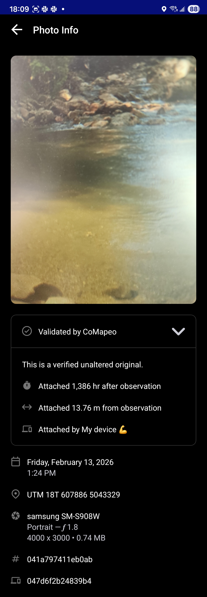

---

[image]

# Revisando uma Observação

Para CoMapeo Mobile v8

## O que é uma Observação?

Uma **Observação** é um dado vinculado a uma categoria e a um único conjunto de coordenadas, representando um ponto no mapa. Ela pode conter várias informações para ajudar a contar uma história ou servir como evidência. As observações são coletadas no CoMapeo e constituem as principais fontes de dados, juntamente com as trilhas.

:::note 💡 Dica
É possível abrir uma observação para revisão selecionando-a no  Mapa ou a partir da     Lista de Observações.

:::

## Porque revisar uma Observação?

Revise uma observação para ver todas as informações que foram registradas com ela. A revisão pode ajudar a confirmar detalhes, verificar evidências e garantir que os dados estejam completos e precisos.

## Quais informações constam em uma Observação?

### Informações adicionadas automaticamente

Essas informações provêm dos sensores do dispositivo, das configurações do dispositivo e do uso do aplicativo, e não podem ser modificadas.

 **Coordenadas e precisão**
A localização da observação é exibida em uma pré-visualização do mapa. Esse costuma ser o detalhe mais importante a ser incluído ao falar sobre ou compartilhar uma observação, especialmente com autoridades e especialistas em SIG.

**Carimbo de data e hora**

Essas informações provêm das configurações do sistema do dispositivo, no momento em que a observação foi coletada.

**Metadados da observação**

Trata-se de metadados associados às coordenadas registradas. Quando o GPS está ligado, esses metadados são capturados diretamente dos sensores e adicionam informações técnicas que podem ser de interesse para quem estiver realizando uma análise jurídica de uma observação. Há uma tela dedicada para exibir essas informações.

**Trilha correspondente**

Se a observação foi coletada enquanto uma trilha estava sendo gravada, o identificador de trilha também aparecerá.

### Informações adicionadas manualmente

- **Nome e ícone da categoria**

- **Descrição**
Notas adicionadas à área de texto

- **Detalhes**
Respostas do formulário **Detalhes** (se preenchido), que inclui campos de texto ou perguntas estruturadas associadas à categoria escolhida.

:::note 💡 Dica
Verifique se as informações adicionadas descrevem corretamente o que foi observado. Se for necessário revisar ou esclarecer alguma coisa, é possível editá-las.

Acesse: 🔗 [Editando um Observação](/docs/editing-observation)   

:::

### Mídia

Se forem adicionadas fotos ou arquivos de áudio a uma observação, eles serão automaticamente anexados a ela.

**Miniaturas e visualizações de fotos**

Todas as miniaturas das fotos tiradas serão exibidas em um carrossel horizontal.

**Metadados das fotos**

Uma tela que exibe os metadados associados a uma foto tirada com o CoMapeo.

**Miniaturas e reprodução de áudio**

Uma miniatura de áudio será exibida para cada gravação.

## Validação de dados no CoMapeo

É importante poder confiar nos dados, na sua origem e na garantia de que não foram adulterados, a fim de construir confiança nas ferramentas e nas metodologias de coleta de dados. Isso também pode ser fundamental se os dados forem admitidos em processos judiciais; nesse caso, as evidências devem ser rastreáveis e verificáveis, o que significa que você deve ser capaz de confirmar como, quando e onde os dados foram coletados.

Uma observação **validada pelo CoMapeo** possui coordenadas GPS e fotos registradas usando o CoMapeo, utilizadas como meio de reforçar sua prova. Para isso, o CoMapeo requer permissões relacionadas à localização e ao uso da câmera do dispositivo. Sem essas duas permissões, o CoMapeo ainda é capaz de coletar dados por meio de opções de entrada manual, mas eles são marcados como **observações não validadas**, pois o CoMapeo não pode garantir que tenham sido inseridos corretamente.

[image]

**Metadados de observação** exibidos no CoMapeo sempre incluirão data e hora, coordenadas GPS, latitude e longitude

 Os metadados **validados** também exibirão precisão, altitude, precisão da altitude e velocidade.

 Os metadados **não validados** exibirão *“ Esses dados foram inseridos manualmente”*, para garantir que fique claro que as coordenadas provêm de uma inserção manual, e não do GPS automático e verificável do telefone.

:::note
👉🏽 **Mais:** Se a inserção manual de coordenadas foi usada ao salvar, a maioria dos metadados de GPS não estará disponível e haverá uma indicação de que a observação não está validada

:::

:::note
👉🏽 **Dica**:  Para compartilhar os metadados da observação com alguém que esteja auxiliando sua equipe, use  **Compartilhar.**  Escolha entre E-mail e WhatsApp para abrir um rascunho de mensagem formatado, pronto para enviar.

:::

**Os metadados da foto** são informações capturadas por um smartphone e são específicas para cada foto tirada. Eles são exibidos abaixo da foto.

Se houver dúvida sobre a validade de uma foto em uma observação, os metadados da foto podem ser incluídos como prova. Esses metadados incluem:

- Data e hora

- Coordenadas GPS da fotografia

- Metadados do dispositivo: tipo de dispositivo, detalhes da câmera, incluindo abertura, e tamanho da foto

- ID da observação

- ID do dispositivo

[image]

Abrir  **Validado pelo CoMapeo** para visualizar detalhes adicionais que indicam a proximidade, em tempo e distância, entre o momento em que a foto foi tirada e o momento em que a observação foi salva. 

[image]

:::note 💡 Dica
Para capturar todas as informações disponíveis em uma única imagem, use a opção,  e role para baixo, que aparece temporariamente após fazer uma captura de tela.

:::

## Mais ações disponíveis

 Editar uma observação

 Deletar uma observação

 Compartilhar uma observação

## Conteúdo relacionado

Acesse 🔗 [Editando uma observação](https://www.notion.so/docs/editing-observation)

Ir para 🔗 [Compartilhamento de uma única observação e metadados](/pt/docs/sharing-a-single-observation-and-metadata)

Ir para 🔗 [Solução de problemas: Observações e trilhas](/pt/docs/troubleshooting-observations-and-tracks)

Ir para 🔗 [Solução: Verificar permissões do aplicativo](https://www.notion.so/Reviewing-an-Observation-26a1b08162d58074948dd100af9095aa)

### **Está tendo problemas?**

Acesse 🔗[Solução de problemas: Observações e trilhas](/pt/docs/troubleshooting-observations-and-tracks)

---

